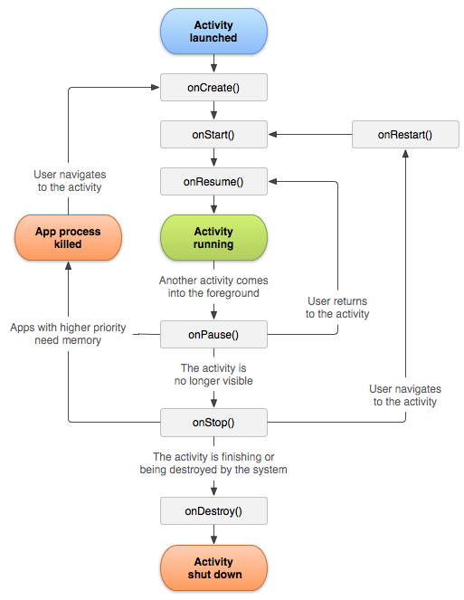
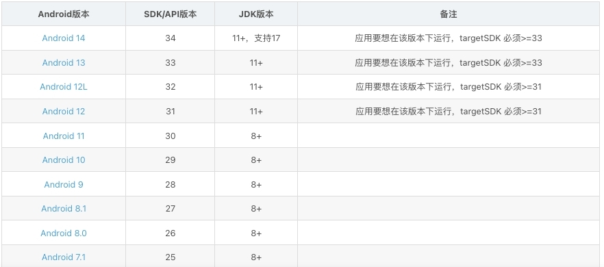

# Andriod 开发

## 应用生命周期

#### Application生命周期

* `onCreate()`初始化: 应用初始化
* `onStart()`启动: 应用开始启动
* `onResume()`运行: 应用进入前台
* `onPause()`暂停和`onStop()`停止: 应用进入后台时
* `onRestart()`重新启动: 由后台进入前台时触发
* `onDestroy()`销毁: 应用不在运行或从内存中卸载时触发

#### Activity生命周期



* `onCreate()`: Activity实例被创建时触发，只会调用一次，可在此进行视图、布局、组件、数据等资源的初始化
* `onStart()`: 视图首次可见时触发，只会调用一次
* `onResume()`: Activity在前台获取焦点或与用户交互时触发
* `onPause()`和`onStop()`: 当其他Activity处于前台时触发，会调用多次，先`onPause()`后`onStop()`
* `onRestart()`和`onResume()`: Activity 返回切换到前台时触发，会调用多次
* `onDestroy()`: Activity被销毁时触发，调用一次

```
public class MyActivity extends AppCompatActivity {  
    @Override  
    protected void onCreate(Bundle savedInstanceState) {  
        super.onCreate(savedInstanceState);  
        setContentView(R.layout.activity_main);  
        // 初始化 Activity 的各种资源
        Log.d("MyActivity", "onCreate() is called.");  
    }  
  
    @Override  
    protected void onStart() {  
        super.onStart();  
        // 做一些 Activity 启动时需要做的事情，例如加载数据等
        Log.d("MyActivity", "onStart() is called.");  
    }  
  
    @Override  
    protected void onResume() {  
        super.onResume();  
        // 做一些 Activity 运行时需要做的事情，例如更新 UI 等
        Log.d("MyActivity", "onResume() is called.");  
    }  
  
    @Override  
    protected void onPause() {  
        super.onPause();  
        // 做一些 Activity 暂停时需要做的事情，例如停止更新 UI 等
        Log.d("MyActivity", "onPause() is called.");  
    }  
  
    @Override  
    protected void onStop() {  
        super.onStop();  
        // 做一些 Activity 停止时需要做的事情，例如释放资源等
        Log.d("MyActivity", "onStop() is called.");  
    }  
  
    @Override  
    protected void onDestroy() {  
        super.onDestroy();  
        // 做一些 Activity 销毁时需要做的事情，例如清除数据等
        Log.d("MyActivity", "onDestroy() is called.");  
    }  
}

```

#### Activity之间的跳转

使用`startActivity`启动名为`SignInActivity`的 Activity
```
// 简单跳转
Intent intent = new Intent(this, SignInActivity.class);
startActivity(intent);
```

使用`startActivity`启动其他应用的 Activity发送电子邮件
```
// EXTRA_EMAIL对应一个包含电子邮件的收件人电子邮件地址的数组
Intent intent = new Intent(Intent.ACTION_SEND);
intent.putExtra(Intent.EXTRA_EMAIL, recipientArray);
startActivity(intent);
```

使用`startActivityForResult`实现回调通信
```
//MyActivity

button.setOnClickListener(new View.OnClickListener() {
  @Override
  public void onClick(View v) {
      // 启动 SecondActivity 并传递参数
      Intent intent = new Intent(MainActivity.this, SecondActivity.class);
      intent.putExtra("key", "This is a parameter from MainActivity");
      startActivityForResult(intent, REQUEST_CODE_SECOND_ACTIVITY);
  }
});
// 接收回调数据
@Override
protected void onActivityResult(int requestCode, int resultCode, @Nullable Intent data) {
   super.onActivityResult(requestCode, resultCode, data);
   // 检查请求码和结果码
   if (requestCode == REQUEST_CODE_SECOND_ACTIVITY) {
       if (resultCode == RESULT_OK && data != null) {
           // 获取从 SecondActivity 返回的结果
           String result = data.getStringExtra("result_key");
           resultTextView.setText(result);
       }
   }
}


```

```
//SecondActivity

@Override
protected void onCreate(Bundle savedInstanceState) {
   super.onCreate(savedInstanceState);
   setContentView(R.layout.activity_second);

   // 获取从 MainActivity 传递的参数
   String param = getIntent().getStringExtra("key");

   Button resultButton = findViewById(R.id.set_result_button);
   resultButton.setOnClickListener(new View.OnClickListener() {
       @Override
       public void onClick(View v) {
           // 设置返回结果并附带额外数据
           Intent intent = new Intent();
           intent.putExtra("key","SecondActivity! Received param: "+param);
           setResult(RESULT_OK, intent);
           finish();
       }
   });
}

```

## Android构建工具版本

Gradle插件版本、Gradle版本、buildTool版本及ndk版本是相互关联的。需要保持对应关系，否则编译会报错。
例如：gradle plugin 4.2.0 需要gradle6.7.1、 buildTool30.0.2、ndk21.4.7075529

[对应关系可在此查看](https://developer.android.google.cn/build/releases/past-releases?hl=zh-cn)

对照表如下：

| Gradle插件 | Gradle | SDK Build Tools | NDK          | JDK  |
| -------- | ------ | --------------- | ------------ | ---- |
| 8.3.x    | 8.4    | 34.0.0          | 25.1.8937393 | 17   |
| 8.2      | 8.2    | 34.0.0          | 25.1.8937393 | 17   |
| 8.1      | 8.0    | 33.0.1          | 25.1.8937393 | 17   |
| 8.0.x    | 8.0    | 30.0.3          | 25.1.8937393 | 17   |
| 7.4.x    | 7.5    | 30.0.3          | 23.1.7779620 | 11   |
| 7.3      | 7.4    | 30.0.3          | 23.1.7779620 | 11   |
| 7.2.x    | 7.3.3  | 30.0.3          | 21.4.7075529 | 11   |
| 7.1.x    | 7.2    | 30.0.3          | 21.4.7075529 | 11   |
| 7.0.x    | 7.0.2  | 30.0.2          | 21.4.7075529 | 11   |
| 4.2.0    | 6.7.1  | 30.0.2          | 21.4.7075529 | 1.8  |
| 4.1.0    | 6.5    | 29.0.2          | 21.1.6352462 |      |
| 4.0.1    | 6.1.1  | 29.0.2          |              |      |
| 3.6.4    | 5.6.4  | 28.0.3          |              |      |
| 3.5.4    | 5.4.1  | 28.0.3          |              |      |
|          |        |                 |              |      |


## Android版本与SDK/API版本、JDK对应关系




## 报错问题1.0

**Unsupported Java.  Your build is currently configured to use Java 17.0.6 and Gradle 5.5.** 

使用的java过高，而 gradle5.5对应的是java8，最新安装的编译器java版本是17。

解决办法是为项目配置低版本的JDK,如下路径，将jbr-17改为1.8
setting -> Build,Execution,Deployment -> Build Tolls -> Gradle


