# Shopify
Shopify 是一站式SaaS模式的电商服务平台，为电商卖家提供搭建网店的技术和模版，管理全渠道的营销、售卖、物流等服务。降低小型商户在网店经营上的技术门槛，是 Shopify 最基础的业务。
商户注册账户，选择网站模版，上传商品并添加描述，设置价格和物流选项，添加收款方式，短时间内就能生成一个美观且可靠的独立站。

[Shopify开发入门](https://juejin.cn/post/7197594278084083772)
[手把手教你搭建Shopify独立站](https://zhuanlan.zhihu.com/p/391042065)
[Shopify Remix App从注册到上线](https://juejin.cn/post/7390549988793270272)

## 本地开发环境

* node18.20+ , 20.10以上
* ruby3.0+
* git2.28+

## 创建Shopify开发者账号

注册Shopify ID, 进入[Shopify开发官网](https://shopify.dev/), 选择注册，选择注册方式。
我这里使用邮箱注册，填写信息后会收到确认邮件，确认即可。

选择用途
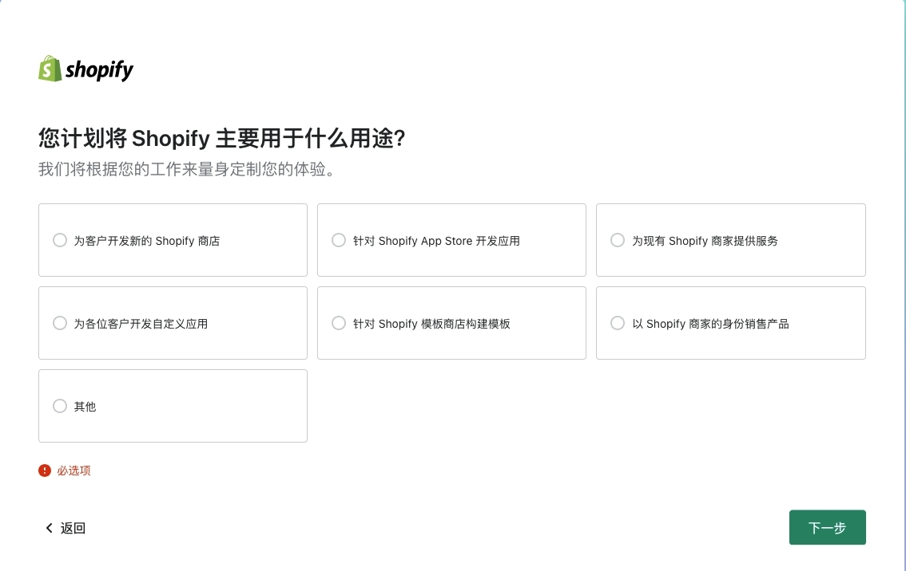

1. 构建shopify商店
2. 构建app
3. 提供商家服务支持
4. 定制app

我也不知道每个选项有何不同，就选了第一个。

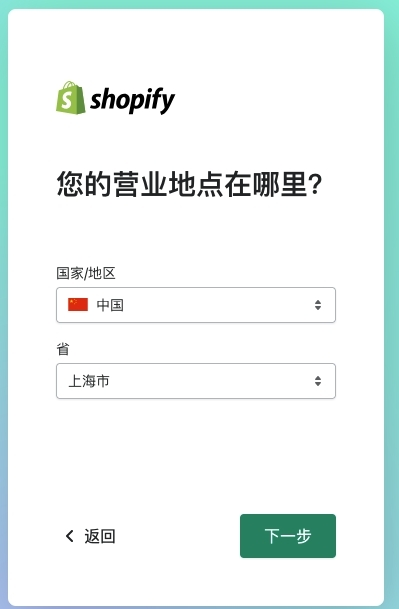

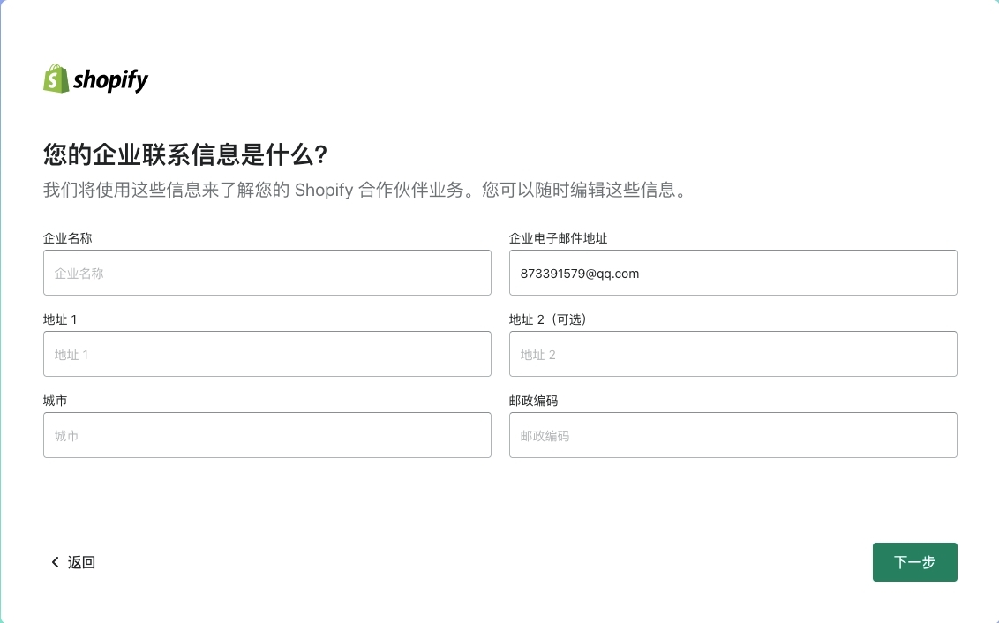

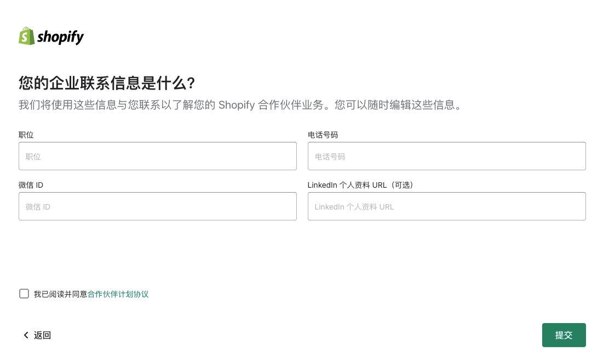

提交完成即可进入到主页。

## 创建开发商店
点击左侧商店，点击【创建开发商店】，开发店铺是完全免费的。

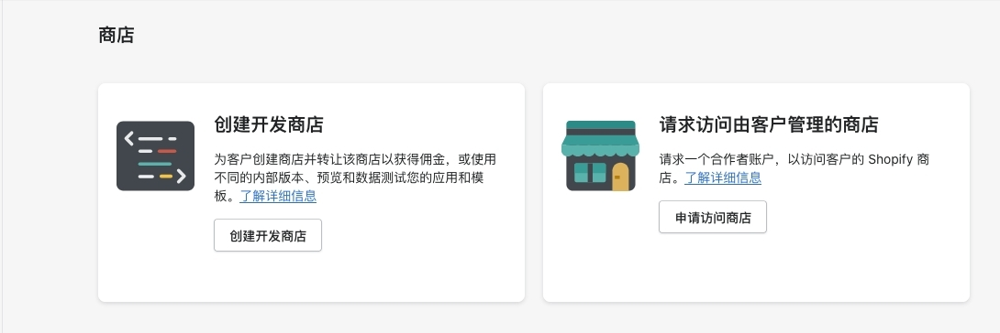

创建用于测试和构建的商店，填写商店名称，会自动生成url，点击【创建开发商店】。

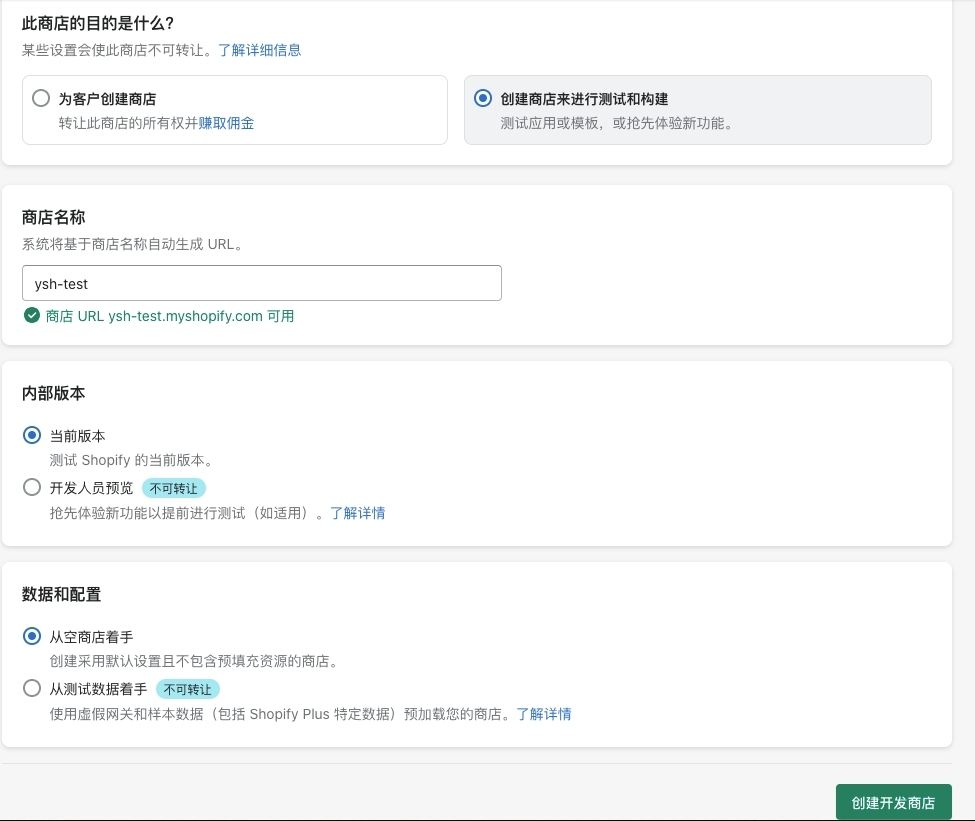

创建完成后会跳转到商店后台，界面如下：

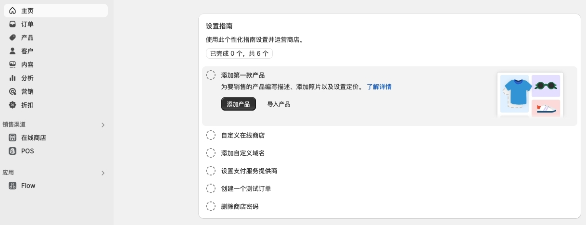

击左侧导航【在线商店】，点击右上角【查看你的商店】。
在线商店链接为`https://[商店名].myshopify.com/`,目前商店仅供开发使用。
可在右下角查看并更改商店密码。

## 如何开发

重新回到[Shopify开发官网](https://shopify.dev/),在下面可以看到


支持构建`定制商店`、`应用`、`主题`。

## 应用开发


您可以构建一个应用程序来为 Shopify 商店添加功能并扩展商家体验，或者为客户创造独特的购买体验。您还可以将 Shopify 商店数据提取到您的应用程序、平台或集成中。
为了根据他们的特定需求定制体验，商家使用 Shopify 应用来帮助建立他们的业务，与外部服务集成，并向他们的 Shopify 后台添加功能。 [开始搭建一个应用程序](https://shopify.dev/docs/apps/build/scaffold-app)

在创建应用前：

1. 创建了一个合作伙伴账户和一个开发商店
2. 安装了Shopify CLI脚手架
3. 使用最新版本的Chrome或Firefox

账号和开发商店上面我们已经都有了，如何安装脚手架：
```
// node18.20+
npm install -g @shopify/cli@latest
// 查看
shopify --version
//@shopify/cli/3.68.1 darwin-x64 node-v20.17.0
```
**注意**要在Shopify CLI中使用开发商店或定制店铺，您需要是商店所有者，或者在商店中拥有员工帐户。


### 商店应用后台

创建新应用：

1. 新建文件夹app
2. cd app
3. 创建：
```
//创建之前会生成一个用户验证码，需要Shopify CLI登录验证
// Logged in之后才会创建项目
shopify app init
```

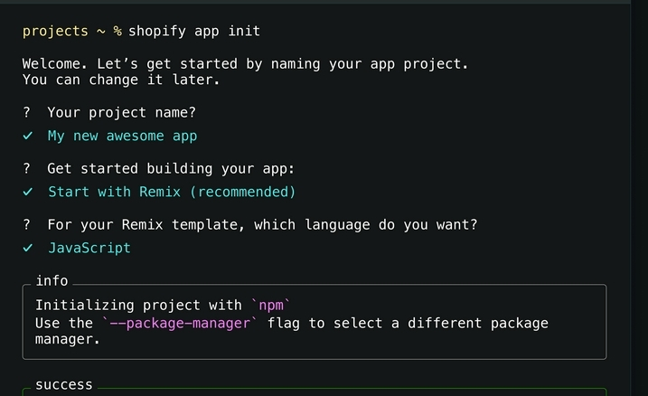

4. 启动服务：
```
npm run dev --verbose
//或
shopify app dev
```
稍等片刻后会提示：

```
Using your default dev store, ysh-test, to preview your project.
? Make this store transfer-disabled? For security, once you use a development store to preview an app locally, the store can never be transferred to a merchant to use as a production store.

(y) Yes, make this store transfer-disabled permanently
(n) No, select another store
```
这里我选择了no,确一直提示。所以又选择了yes

如果报错如下：
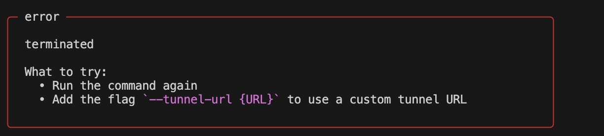

说明URL没有配置，选择应用->配置->URL，配置应用url，例如`https://ysh-test.myshopify.com/`。

重新执行：

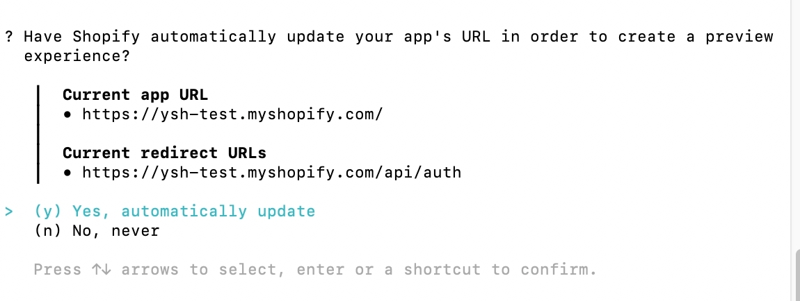

选择：automatically update

运行结果如下：

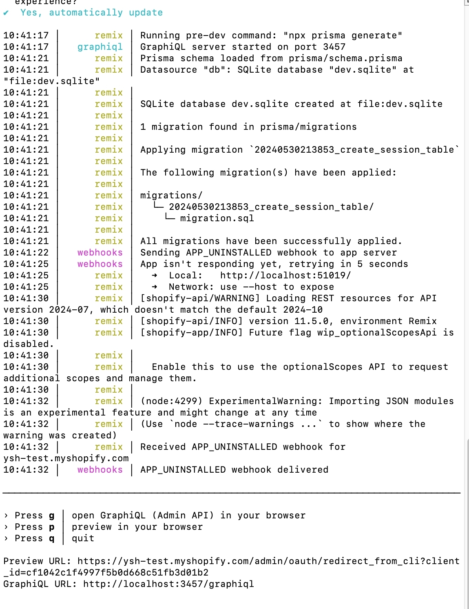

输入p可预览界面。但我这里却无法访问，查资料说**需要设置内网穿透**

**设置内网穿透**
未设置时网页无法访问。我们设置ngrok， [ngrok官网-https://ngrok.com/](https://link.juejin.cn?target=https%3A%2F%2Fngrok.com%2F)，使用邮箱注册登录后来到控制台；

我这里注册一直报错，使用GitHub创建账号，登录也是一直报错！

可以使用[TryCloudflare工具](https://developers.cloudflare.com/cloudflare-one/connections/connect-networks/downloads/)来尝试Cloudflare穿透，而无需向Cloudflare的DNS添加站点。TryCloudflare将启动一个进程，在TryCloudflare.com上生成一个随机子域。对该子域的请求将通过Cloudflare网络代理到您在localhost上运行的web服务器。

1. [下载cloudflared工具](https://developers.cloudflare.com/cloudflare-one/connections/connect-networks/downloads/)，或安装`cloudflared`:

```
brew install cloudflared
```

2. 启动一个可通过localhost访问`cloudflared`的web服务器
3.  运行如下命令开启穿透

```
cloudflared tunnel --url http://localhost:8080
```

**注意**

如果`.cloudflared`目录中存在`config.yaml`配置文件，则目前不支持TryCloudflare快速穿透。可能需要临时重命名该文件才能使用该功能


Cloudflare穿透依然还是没有成功？？？


## Remix开发应用

[Remix](https://link.juejin.cn/?target=https%3A%2F%2Fremix.run%2Fdocs) 是由 React Router 的创建者开发的全栈Web框架，类似Next.js框架。

新创建的Shopify App项目结构目录如下：

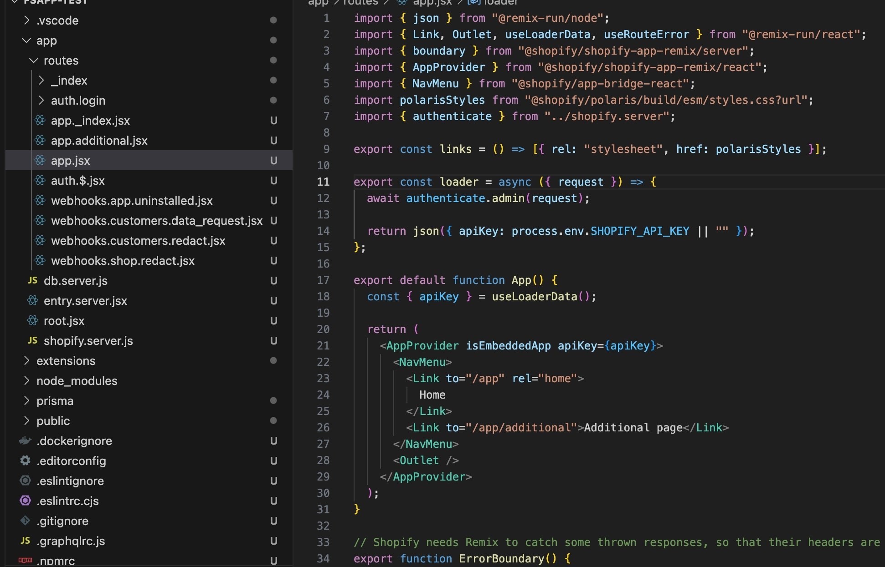

Remix支持嵌套路由，在文件名中以`.`分隔父子路由,


### 商店客户端


