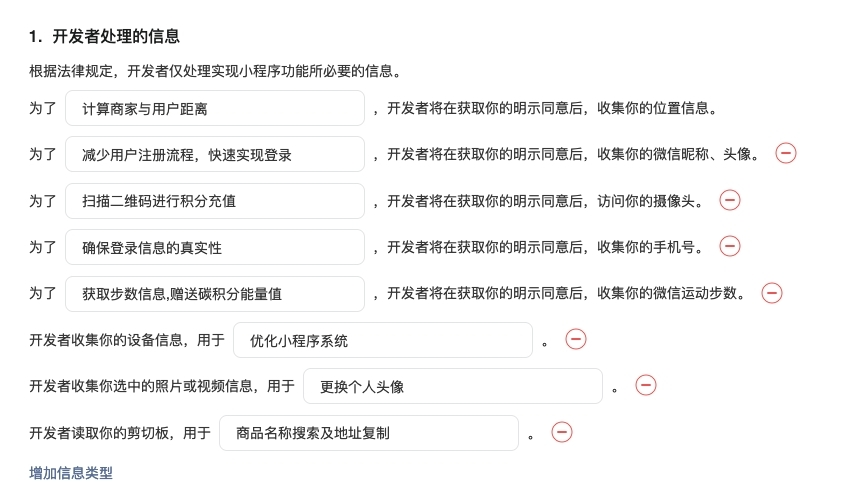
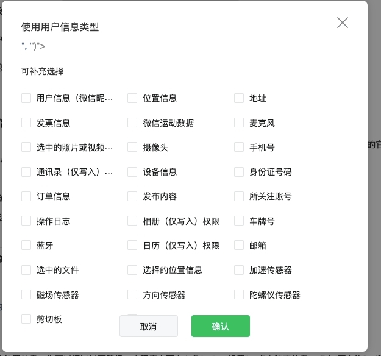

# Taro开发

## 跳转交互处理
跳转传参通过query方式，获取参数方式：
```
// 方式一: 推荐
const router = Taro.useRouter();
const params = router.params;
// 方式二
const params = getCurrentInstance().router.params;
// 方式三
const currentPages = getCurrentPages(); // 获取当前页面栈
const params = currentPages[currentPages.length - 1].options;
```
回传参数：Taro.Event或Taro.eventCenter


## 自定义弹框

modal弹框可使用`Taro.showModal`,但它的按钮文本限制4个字符，超过四个就不能用了。或者需要其他样式的弹框，我们就需要自定义弹框了。
在page界面使用`position`的`fixed`和`z-index`配合即可实现，但是在子组件中使用则可能会出问题。这个时候可以使用小程序特有的组件`RootPortal`进行包裹。
伪代码如下：
```
export class Modal extends Component {

  static defaultProps = {
    visible: false,       //弹窗显示
    title: '',              //标题
    content: '',            //内容
    actions: [{ text: '取消', onPress: () => { } }],
    plan: true, //底部按钮样式
  }

  constructor(props) {
    super(props);
    this.state = {
      visible: false,
      ...props
    }
  }
}

  componentWillReceiveProps(nextProps) {
    if (Object.keys(nextProps).filter(e => typeof nextProps[e] !== 'object' && this.props[e] !== nextProps[e]).length > 0) {
      this.setState({ ...nextProps });
    }
  }

show(option = {}) {
	this.setState({ ...option, visible: true })
}

close() {
	this.setState({ visible: false })
}
  
render() {
	const { visible, title, content, actions } = this.state;
	return (
      <RootPortal enable={visible}>
      	<View className={styles.modal} style={{ display: visible ? 'flex' : 'none' }}>
      	...
			</View>
      </RootPortal>
    )
}

```
使用：
```
//现在render中引入
<CommonModal ref={modalRef}/>
// 调用
modalRef.current.show({
   title: modalConfig.title, 
   content: modalConfig.content, 
   actions: [
     { text: modalConfig.cancelText,  onPress: () => {} }, 
     { text: <Button  
               type='primary'
               onPress={() => {}}
     >{modalConfig.confirmText}</Button> }
   ]
 })

```


## 拨打电话
```
Taro.makePhoneCall({
	phoneNumber: '10086'
})

```

## 权限清单
登录微信公众平台-账户设置-设置-基本设置-服务内容声明-用户隐私保护指引




同时需要在`app.config.ts`文件的`permission`字段中添加相应的权限说明。

### 判断权限是否可用
```
export function isPermission(scope) {
  if(!scope) return Promise.resolve(false);
  // scope = 'scope.userLocation';
  return new Promise((resolve)=>{
    Taro.getSetting({
      success: (res)=> {
        if (!res.authSetting[scope]) {
          Taro.authorize({
            scope,
            success: ()=> {
              resolve(true);
            },
            fail: ()=> {
              resolve(false);
            }
          })
        }else {
          resolve(true);
        }
      },
      fail: ()=> {
        resolve(false);
      }
    })
  })
}

```

### 定位

```
export class Geolocation {
  static async getCurrentPosition() {
    if (await isAuth('scope.userLocation')) {
      return new Promise((resolve)=>{
        Taro.getLocation({
          type:'gcj02',
          isHighAccuracy:true,
          success: function (res) {
            resolve({status:1,message:'定位成功',coords:res});
          },
          fail: function () {
            resolve({status:0,message:'定位失败'});
          }
        })
      });
    } else{
      return new Promise((resolve)=>{
        resolve({status:0,message:'没有权限'});
      });
    }
  }
}

```

### 获取小程序版本

```
// 仅获取线上小程序版本号
const accountInfo = Taro.getAccountInfoSync();
const version = accountInfo.miniProgram.version;
```

### 获取用户信息

### 相机相册权限
```
Taro.chooseImage({
      count: 1, // 默认9
      sizeType: ['original', 'compressed'], // 可以指定是原图还是压缩图，默认二者都有
      sourceType: ['album', 'camera'], // 可以指定来源是相册还是相机，默认二者都有，在H5浏览器端支持使用 `user` 和 `environment`分别指定为前后摄像头
      success: (res) => {
        const path = res.tempFilePaths[0]
        console.log(path);
      },
      fail: (err)=>{
        console.log(err)
      }
    })

```

### 剪切板
剪切板也是需要做权限申请的。
```
 Taro.setClipboardData({
   data: 'data',
   success: function (res) {
     Taro.getClipboardData({
       success: function (res) {
         console.log(res.data) // data
       }
     })
   }
 })

```

## 获取openId
用户的openid在一个开发者账户中是唯一的。
```
export const getOpenId = (()=> {
  let openId = undefined;
  return ()=> {
    return new Promise((resolve, reject) => {
      if(openId) {
        resolve(openId)
      }else {
        Taro.login({
          success: async (res) => {
            console.log('Taro.login', res)
            if (res.errMsg === 'login:ok') {
              const JSCODE = res.code;
              // 该url需后端转发，前端不可直接调用
              const url = `https://api.weixin.qq.com/sns/jscode2session?appid=${APPID}&secret=${SECRET}&js_code=${JSCODE}&grant_type=authorization_code`
              const result: any = await Service(url);
              if (result.status > 0) {
                openId = result.data?.openId;
                resolve(result.data?.openId)
              }else {
                resolve(false)
              }
            }
          },
          fail: (err) => {
            console.error(err)
            resolve(false)
          },
        });
      }
      
    })
  }
  
})();

```

## 下拉刷新加载更多

### page的下拉刷新
需在当前page的config中将`enablePullDownRefresh`设置为`true`。不可设置`disableScroll`，若将`disableScroll`也设置为`true`，则模拟器可以下拉刷新，真机不行。
设置好后添加下拉刷新代码：
```
Taro.usePullDownRefresh(() => {
    initData().then(() => Taro.stopPullDownRefresh())
 })
Taro.useReachBottom(()=>{
    console.log('触底回调')
})

```

### ScrollView下拉刷新
ScrollView不需要修改页面config配置。样式设置padding无效。
```
<ScrollView
	scrollY
	refresherEnabled
	refresherTriggered={refresherTriggered}
	onRefresherRefresh={onRefresherRefresh}
	onScrollToLower={onLoadMore}
>
...
</ScrollView>

```

### 自定义下拉刷新
可参考@nutui/nutui-react-taro

## 小程序跳转
#### 小程序打开小程序
```
Taro.navigateToMiniProgram({
   appId: 'xxx',
   path: item.detailUrl,
   envVersion: 'develop', // develop（开发版），trial（体验版），release（正式版）
   extraData: {}
 })

```
#### h5打开小程序
需要先npm引入`weixin-js-sdk`或cdn引入`//res.wx.qq.com/open/js/jweixin-1.6.0.js`
```
window.wx.miniProgram.navigateTo({url: path});
```
#### 公众号打开小程序

需要先npm引入`weixin-js-sdk`或cdn引入`//res.wx.qq.com/open/js/jweixin-1.6.0.js`
微信接口配置：
```
initConfig = (appId, timestamp, nonceStr, signature) => {
    const config = {
      debug: false, // 开启调试模式,调用的所有api的返回值会在客户端alert出来，若要查看传入的参数，可以在pc端打开，参数信息会通过log打出，仅在pc端时才会打印。
      appId: appId, // 必填，公众号的唯一标识
      timestamp: timestamp, // 必填，生成签名的时间戳
      nonceStr: nonceStr, // 必填，生成签名的随机串
      signature: signature, // 必填，签名
      jsApiList: [
        'updateTimelineShareData',
        'updateAppMessageShareData',
        'onMenuShareTimeline',
        'onMenuShareAppMessage',
        'onMenuShareQQ',
        'onMenuShareWeibo',
        'onMenuShareQZone',
        'scanQRCode',
        'hideOptionMenu',
        'showOptionMenu',
        'getLocation',
        'chooseImage',
        'previewImage',
        'getLocalImgData',
        'showMenuItems',
        'hideMenuItems',
        'hideAllNonBaseMenuItem',
        'showAllNonBaseMenuItem',
        'checkJsApi',
      ], // 必填，需要使用的JS接口列表
    } as any;
    config.openTagList = ['wx-open-launch-app']
    wx.config(config);
  };

```
跳转小程序：
```
window.wx.miniProgram.navigateTo({url: path});
```

公众号微信授权：
```js
//snsapi_base 表示用户授权后，公众号或小程序可以获取用户的基础信息，但不包括用户的私有信息
const scope = 'snsapi_base';
//state：STATE 开发者定义的参数，用于在授权请求中添加额外的业务参数。这些参数会在授权回调时原样返回给开发者
//redirect_uri： 用户授权成功后，微信会将用户重定向到这个 URI，并附上授权码
const redirectURL = encodeURIComponent(redirectURL);
const authURL = `https://open.weixin.qq.com/connect/oauth2/authorize?appid=${appId}&redirect_uri=${redirectURL}&response_type=code&scope=${scope}&state=${state}#wechat_redirect`;
window.location.href = authURL;

```


#### app打开小程序

ios:
```
RCT_EXPORT_METHOD(launchMiniApp:(NSString*)appId userName:(NSString*)userName path:(NSString*)path extMsg:(NSString*)extMsg isRelease:(BOOL)isRelease) {
  WXLaunchMiniProgramReq *launchMiniProgramReq = [WXLaunchMiniProgramReq object];
  launchMiniProgramReq.userName = userName;  //拉起的小程序的username
  launchMiniProgramReq.path = path;
  launchMiniProgramReq.extMsg = extMsg;
  launchMiniProgramReq.miniProgramType = isRelease?WXMiniProgramTypeRelease:WXMiniProgramTypePreview; //拉起小程序的类型
  //1.8.6及以后的SDK用以下方法
  [WXApi sendReq:launchMiniProgramReq completion:^(BOOL success) {
    if (success) {

    }else{

    }
  }];
}

```
andriod:
```
@ReactMethod
    public void launchMiniApp(String appId,String miniId,String path,String extData,boolean isRelease){
        IWXAPI api = WXAPIFactory.createWXAPI(getReactApplicationContext(), appId);
        WXLaunchMiniProgram.Req req = new WXLaunchMiniProgram.Req();
        req.userName = miniId; // 填小程序原始id
        req.path = path;//拉起小程序页面的可带参路径，不填默认拉起小程序首页，对于小游戏，可以只传入 query 部分，来实现传参效果，如：传入 "?foo=bar"。
        if(isRelease){
            req.miniprogramType = WXLaunchMiniProgram.Req.MINIPTOGRAM_TYPE_RELEASE;// 可选打开 开发版，体验版和正式版
        }else{
            req.miniprogramType = WXLaunchMiniProgram.Req.MINIPROGRAM_TYPE_PREVIEW;//MINIPROGRAM_TYPE_PREVIEW
        }
        req.extData = extData;
        api.sendReq(req);
    }

```
rn:
```
Umeng.UMShareModule.launchMiniApp(appId, userName, path, extData, tempRelease);

```

#### 小程序打开app
打开app受限，只有某些条件下可以打开。
```
<Button 
type='primary' 
openType='launchApp' 
onError={(err) => {
  //launchApp功能受限
  console.log(err);
  onPress({confirm: true})
}}>打开app</Button>

```


## 插件的使用
需要在[公众平台](https://developers.weixin.qq.com/miniprogram/dev/framework/plugin/using.html)添加，然后在`app.config.ts`中的`plugins`字段配置插件：
```
plugins: {
  captcha: {
     version: '1.0.3',
     provider: 'pluginProviderAppid',
  },
},

```

* captcha: 插件名,由使用者自定义,无需和插件开发者保持一致
* version: 使用的插件版本
* provider: 插件提供者的appid

如果插件只在一个分包内用到，可以将插件仅放在这个分包内。

#### 使用
在使用的页面配置中声明：
```
usingComponents: {
    "t-captcha": "plugin://captcha/t-captcha"
 }

```
页面渲染：
```
<t-captcha
   id="captcha"
   appId={process.env.WEAPP_CAPCHAID}
   onReady={() => {
     console.log('onReady')
   }}
   onClose={() => {
     console.log('onClose')
   }}
   onError={(e) => {
     console.log('onError', e)
   }}
   onVerify={async (ev) => {
     console.log(ev)
     if (ev.detail.ret === 0) {
       //ev.detail.ticket
     }
   }}
 />

```
页面调用：
```
const { page } = getCurrentInstance()
page.selectComponent('#captcha').show()

```

## 小程序支付
支付权限需开通且为企业账户
```
  const payWithPayParam = (payParam:any={}) => {
    Taro.requestPayment({
      timeStamp: payParam.timeStamp,
      nonceStr: payParam.nonceStr,
      package: payParam.package ?? payParam.prepayId,
      paySign: payParam.paySign,
      signType: payParam.signType ?? 'RSA',
      success: (res) => {
        console.warn(res)        
      },
      fail: (error) => {
        console.log(error)
      },
    })
  }

```

## webView交互
webview非企业账户不支持。小程序中使用的api接口都必须配置，webview中链接也要配置业务域名方可使用。
小程序中webview交互能力受限，多数通过query参数传递。
刷新推荐`Taro.redirectTo`,其他方案均有缺陷。

```
/**
 * @description: WebView
 * @param {url}
 * @callback { Taro.eventCenter.trigger('webviewReload', {reload: true}) } 刷新webview
 * @callback { Taro.eventCenter.trigger('webviewReload', {callback: any}) } 回调数据
 * @returns {/pages/webview/index?url=`encodeURIComponent(url)`}
*/
import checkAuth from '@/components/common/auth';
import { Util } from '@/library';
import { View, WebView } from '@tarojs/components';
import Taro, { setNavigationBarTitle } from '@tarojs/taro';
import { BaseService } from 'gktapp-service';
import { useEffect, useMemo, useRef, useState } from 'react';

interface IWebParams extends Partial<Record<string, any>> {
  url: string,
  progressbarColor?: string,
  title?: string,
  auth?: '0'| undefined, // 是否需要鉴权
  navBar?: '0'| '1'| undefined
}

interface WebMessage {
  enventName: string,
  data: any;
}

const decodeURL = (url: string) => {
  if(!url) return url;
  if (url.indexOf('%') < 0) {
    return url
  } else {
    const newUrl = decodeURIComponent(url)
    return decodeURL(newUrl)
  }
}

const EnventNames: string[] = ['webviewReload'];

definePageConfig({
  navigationStyle: 'custom',
  navigationBarTitleText: '',
  enableShareAppMessage: true,
  //支持受限：webview页面不支持分享朋友圈
  enableShareTimeline: false,
})

export default () => {
  const router = Taro.useRouter();
  const {url, progressbarColor, title, navBar, auth} = router.params as IWebParams;
  const [__url, setURL] = useState(decodeURL(url));
  const [listenerData, setListenerData] = useState<any>(null);

  const webviewRef = useRef(null);

  Taro.useLoad((param) => {
    console.log('useLoad,', param);
    if(__url){
      Taro.showLoading();
    }
  })

  Taro.useDidShow(()=>{
    console.log('useDidShow')
    // 小程序webview无法隐藏导航栏 
    if(Number(navBar) === 1) { }
    if(auth !== '0') {
      checkAuth();
    }
    
  })

  Taro.useUnload(()=>{
    console.log('useUnload')
  })
  
  useEffect(() => {
    if (title) {
      setNavigationBarTitle({ title: decodeURIComponent(title) })
    }
    Taro.eventCenter.on('webviewReload', (data: any) => {
      console.log('Taro.eventCenter-webviewReload:', data);
      if(data) {
        if(data.reload) {
          //仅刷新
          reload(2);
        }else {
          // 数据回调
          data = Object.keys(data).map(key =>`${key}=${JSON.stringify(data[key] ?? '')}`).join('&');
          if(data?.length > 0){
            setListenerData(data);
          }
        }
      }
    })
    return ()=> {
      while (EnventNames.length > 0) {
        const name = EnventNames.pop();
        name && Taro.eventCenter.off(name);
      }
    }
  },[])

  useEffect(() => {
    if(listenerData) {
      console.log('listenerData:', listenerData)
      if(__url.includes('?')) {
        setURL(`${__url}&${listenerData}`)
      }else {
        setURL(`${__url}?${listenerData}`)
      }
    }
  },[listenerData])


  //分享设置
  // Taro.useShareAppMessage(() => {
  //   return {
  //     path: '/pages/webview/index?url=' + encodeURIComponent(__url)
  //   }
  // })

  // 刷新方案并不理想
  const reload = Util.debounce((flag = 2) => {
    console.log('flag:', flag)
    if(flag == 0) {
      // query方案：
      //setListenerData 方式 history.length会增加
    }else if(flag == 1) {
       // 方案一：不稳定会白屏
      const tempUrl = __url;
      setTimeout(()=>{
        setURL('');
        setTimeout(() => {
          setURL(tempUrl);
        },100)
      },0)
    }else if(flag == 2){
      // 方案二：重新加载
      Taro.redirectTo({url: `/pages/webview/index?url=${encodeURIComponent(__url)}`})
    }else {
      // 方案三：不可行
      const webview: any = webviewRef.current;
      if(webview && webview.reload) {
        webview.reload();
      }
    }
    
  }, 500)

  const onLoadFinshed = async ()=> {
    if(__url.includes('copy=')) {
      Taro.setClipboardData({
        data: __url,
        success: () => {
          const show = 1;
          if(show == 1) {
            Taro.showToast({
              title: '链接已复制,请前往浏览器打开',
              icon: 'none',
              duration: 2000
            })
          }else if(show ==2) {
            Taro.showModal({
              title: '',
              content: '链接已复制,请前往浏览器打开',
              confirmText: '好的',
              confirmColor: '#CAA846',
              showCancel: false,
            })
          }
          
        }
        
      })
      
    }
  }

  const onLoad = ({detail}) => {
    Taro.hideLoading();
    console.warn('onLoad:',detail);
    if (title) {
      setNavigationBarTitle({ title: decodeURIComponent(title) })
    }
    onLoadFinshed();
  }
  const onError = (e: any) => {
    Taro.hideLoading();
    console.warn('onError')
    console.warn(e)
  }
  
  /**
   * @description 在特定时机(小程序后退，组件销毁，分享)触发
   * @param { wx.miniProgram.postMessage({data: {enventName: string, data: any}}) } 
   * @param { detail }
  */
  const onMessage = ({detail}) => {
    console.warn('onMessage:', detail)
    if(detail.data && detail.data.length > 0) {
      const message: WebMessage = detail.data[detail.data.length - 1];
      console.log(message);
      if(message.enventName) {
        EnventNames.push(message.enventName);
        Taro.eventCenter.trigger(message.enventName, message.data);
      }
      
    }
  }

  const src = useMemo(() => {
    if(auth == '0') {
      return __url;
    }
    const userInfo = BaseService.loginUser as any;
    let src = __url;
    if(src && !src.includes('token') && userInfo.token) {
      const info = {
        clientId: userInfo.clientId,
        token: userInfo.token,
        loginName: userInfo.loginName,
        login_status: userInfo.login_status,
      }
      if(src.includes('?')) {
       src += `&userInfo=${encodeURIComponent(JSON.stringify(info))}`
      }else {
       src += `?userInfo=${encodeURIComponent(JSON.stringify(info))}`
      }
    }
    return src;
  },[__url]);

  return (
    <View>
      {
        src ? 
        <WebView src={src} 
            id={'webview'}
            progressbarColor={progressbarColor}
            onLoad={onLoad}
            onError={onError}
            onMessage={onMessage} 
        />:
        <View className='webview-desc'></View>
      }
    </View>
  )
}


```


