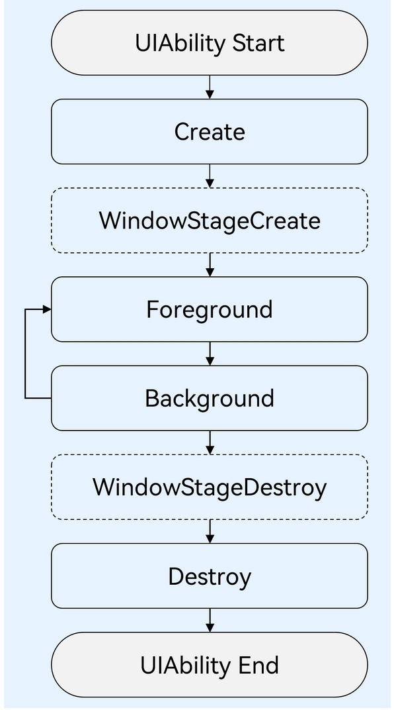

# harmonyOS: 基础开发


## 项目目录结构（Stage模型）

* AppScope > app.json5: 应用的全局配置信息

  1. bundleName: 标识应用的唯一性
  2. icon: 应用图标
  3. label: 应用名称
  4. versionCode: 应用的版本号，值为32位非负整数
  5. versionName: 标识应用版本号的文字描述，用于向用户展示。例如：'1.0.0'
  6. minAPIVersion: 标识应用运行需要的SDK的API最小版本。由build-profile.json5中的compatibleSdkVersion生成
  7. targetAPIVersion: 标识应用运行需要的API目标版本。由build-profile.json5中的compileSdkVersion生成。
* entry: HarmonyOS工程模块，编译构建生成一个HAP包
  * src > main > ets：用于存放ArkTS源码。
  * src > main > ets > entryability：应用/服务的入口。
  * src > main > ets > pages：应用/服务包含的页面。
  * src > main > resources：用于存放应用/服务所用到的资源文件，如图形、多媒体、字符串、布局文件等。
      * src > main > resources > base > profile > main_pages.json: 用于存放路由
      * src > main > resources > base > element > color.json:
      * src > main > resources > base > element > float.json:
      * src > main > resources > base > element > string.json:
      * src > main > resources > base > media: 
  * src > main > module.json5：Stage模型模块配置文件。主要包含HAP包的配置信息、应用/服务在具体设备上的配置信息以及应用/服务的全局配置信息。[module.json5配置文件](https://developer.harmonyos.com/cn/docs/documentation/doc-guides-V3/module-configuration-file-0000001427744540-V3)

  * build-profile.json5：当前的模块信息、编译信息配置项，包括buildOption、targets配置等。其中targets中可配置当前运行环境，默认为HarmonyOS。
  * hvigorfile.ts：模块级编译构建任务脚本，开发者可以自定义相关任务和代码实现。
* oh_modules：用于存放三方库依赖信息。
* oh-package.json5: 应用级三方库依赖配置信息。
* build-profile.json5：应用级配置信息，包括签名、产品配置等。
* hvigorfile.ts：应用级编译构建任务脚本。

## UIAbility

UIAbility也是系统调度的单元，为应用提供窗口在其中绘制界面。一个应用可以有一个UIAbility，也可以有多个UIAbility。

**UIAbility启动模式有三种:**

* singleton: 单实例模式,也是默认启动模式。该模式下若UIAbility实例存在会进入`onNewWant`回调。该模式需要在`module.json5`文件中的`module->abilities`下`launchType`字段配置为`singleton`。
* multiton: 多实例模式,每次调用`startAbility()`都会在应用进程中创建一个新的UIAbility实例。该模式需要在`module.json5`文件中的`module->abilities`下`launchType`字段配置为`multiton`。
* specified: 指定实例模式,针对一些特殊场景使用。在其他模式下使用`context.startAbility(want)`根据唯一key来启动指定的`specified`模式的Ability。该模式需要在`module.json5`文件中的`module->abilities`下`launchType`字段配置为`specified`。


## UIAbility生命周期状态



UIAbility的生命周期包括Create、Foreground、Background、Destroy四个状态，WindowStageCreate和WindowStageDestroy为窗口管理器（WindowStage）在UIAbility中管理UI界面功能的两个生命周期回调。

* onCreate: 在UIAbility实例创建时触发
* onWindowStageCreate: UIAbility实例创建完成之后，在进入`Foreground`之前，系统会创建一个WindowStage。`WindowStage`为本地窗口管理器，用于管理窗口相关的内容，例如与界面相关的获焦/失焦、可见/不可见。每一个UIAbility实例都对应持有一个WindowStage实例。在`onWindowStageCreate`回调中，通过`loadContent`接口设置UI页面加载、设置WindowStage的事件订阅。
* onForeground: UIAbility切换至前台时触发,此时应用处于`Foreground`状态。在`onForeground`回调中申请系统需要的资源，或者重新申请在`onBackground`中释放的资源。
* onBackground: UIAbility切换至后台时候触发。此处可以释放UI页面不可见时无用的资源，或者执行较为耗时的操作，例如状态保存等
* onWindowStageDestroy: 在UIAbility实例销毁之前调用，可在此时释放UI页面资源。
* onDestroy: 在UIAbility销毁时触发

## BackupExtensionAbility

BackupExtensionAbility，是Stage模型中扩展组件ExtensionAbility的派生类。开发者可以通过修改配置文件定制备份恢复框架的行为，包括是否允许备份恢复，备份哪些文件等

## ArkUI状态管理

* @State: 组件内的状态管理
* @Prop: 父子组件单向同步，当子组件中的状态依赖父组件传递的数据时，需要使用@Prop装饰器
* @Link: 父子组件状态双向同步时，父组件状态使用@State装饰，子组件使用@Link装饰器，传递时使用`$`修饰表示传递的是引用
* @Watch: 监听状态变化,当状态发生变化时，会触发声明时定义的回调,例如：`@Watch('onClickIndexChanged') clickIndex: number;`当clickIndex状态变化时，将触发onClickIndexChanged回调
* @Provide和@Consume: 跨组件层级双向同步状态。 
  * @Provide装饰的状态变量自动对其所有后代组件可用，即该变量被“provide”给他的后代组件。由此可见，@Provide的方便之处在于，开发者不需要多次在组件之间传递变量。
  * 后代通过使用@Consume去获取@Provide提供的变量，建立双向数据同步。与@State/@Link不同的是，前者可以在多层级的父子组件之间传递。
  * @Provide和@Consume可以通过相同的变量名或者相同的变量别名绑定，变量**类型**必须相同。

#### @Observed和@ObjectLink

@Observed和@ObjectLink: 监听嵌套类对象属性变化。上面的装饰器都是无法观察到第二层属性变化的

* @ObjectLink和@Observed类装饰器用于在涉及嵌套对象或数组的场景中进行双向数据同步
* 被@Observed装饰的类，可以被观察到属性的变化；
* @Observed装饰的类，如果其属性为非简单类型，比如class、Object或者数组，也需要被@Observed装饰，否则将观察不到其属性的变化。
* @ObjectLink在子组件中接收@Observed装饰的类的实例，父组件中对应的状态变量建立双向数据绑定。
* 单独使用@Observed是没有任何作用的，需要搭配@ObjectLink或者@Prop使用。
* @ObjectLink装饰的变量不能被赋值，@ObjectLink装饰的变量和数据源的关系是双向同步，@ObjectLink装饰的变量相当于指向数据源的指针。如果一旦发生@ObjectLink装饰的变量的赋值，则同步链将被打断。

**限制条件**
1. 使用@Observed装饰class会改变class原始的原型链，@Observed和其他类装饰器装饰同一个class可能会带来问题。
2. @ObjectLink装饰器不能在@Entry装饰的自定义组件中使用。

**原理**

* 初始渲染: 
  1. @Observed装饰的class的实例会被不透明的代理对象包装，代理了class上的属性的setter和getter方法
  2. 子组件中@ObjectLink装饰的属性从父组件初始化，接收被@Observed装饰的class的实例，@ObjectLink的包装类会将自己注册给@Observed class。

* 属性更新：当@Observed装饰的class属性改变时，会走到代理的setter和getter方法，然后遍历依赖它的@ObjectLink包装类，通知数据更新。

## @Enty和@Component生命周期


页面即被`@Entry`装饰的组件，一个页面有且仅能有一个@Entry， 其生命周期接口:
* `onPageShow`：页面每次显示时触发一次，包括路由过程、应用进入前台等场景，仅@Entry装饰的自定义组件生效。
* `onPageHide`：页面每次隐藏时触发一次，包括路由过程、应用进入前后台等场景，仅@Entry装饰的自定义组件生效。
* `onBackPress`：当用户点击返回按钮时触发，仅@Entry装饰的自定义组件生效。

组件生命周期,即一般用`@Component`装饰的自定义组件的生命周期:
* `aboutToAppear`：组件即将出现时回调该接口，具体时机为在创建自定义组件的新实例后，在执行其build()函数之前执行。
* `aboutToDisappear`：在自定义组件析构销毁之前执行。不允许在aboutToDisappear函数中改变状态变量，特别是@Link变量的修改可能会导致应用程序行为不稳定。

`@Preview`是一个装饰器，用于在 DevEco Studio快速调试布局,实时预览 UI。

**周期方法交互流程:**

页面冷启动流程: Page aboutToAppear --> Page build --> Child aboutToAppear --> Child build --> Child build执行完毕 --> Page build执行完毕 --> Page onPageShow

删除Child组件: 会执行Child aboutToDisappear方法.

调用router.pushUrl: 会执行Page onPageHide， 页面被隐藏，并没有销毁.

调用router.replaceUrl: 当前页面被销毁,执行的生命周期流程将变为: Page onPageHide --> Page aboutToDisappear --> Child aboutToDisappear。

返回操作: 触发Page onBackPress, 并销毁当前的Page.

最小化应用或者应用进入后台: 触发Page onPageHide。当前Page页面没有被销毁，所以并不会执行组件的aboutToDisappear。

应用回到前台: 执行Page onPageShow。

退出应用，执行Page onPageHide --> Page aboutToDisappear --> Child aboutToDisappear。

`@Builder` 用于修饰function，并且该function返回一个需要渲染的部件元素，主要用于布局代码的抽离。

 ```
    build() {
        Navigation() {
            Scroll() {
                Column() {
                    ···
                }
                .height('100%')
                .width('100%')
                .justifyContent(FlexAlign.Start)
            }
            .width('100%')
            .height('100%')
            .padding({ top: 5 })
        }
        .title(this.title)
        .titleMode(NavigationTitleMode.Mini)
        .hideBackButton(false)
        .height('100%')
        .width('100%')
        .navBarPosition(NavBarPosition.Start)
        .menus(this.NavigationMenus())
    }

    @Builder
    NavigationMenus() {
        Row() {
            Button('确定')
                .type(ButtonType.Normal)
                .height(30)
                .width(60)
                .margin({ right: 18 })
                .enabled(this.newlyCheckedUsers().length > 0)
                .fontSize(14)
                .borderRadius(4)// .backgroundColor(Color.Blue)
                .onClick(() =>
                })
        }
        .height('100%')
        .justifyContent(FlexAlign.Center)
        .align(Alignment.Center)
    }

 ```

## 导航Navigation
堆栈需要使用`Navigation`包裹，子页需要使用`NavDestination`.
例如根导航：
```
pathStack: NavPathStack = new NavPathStack();

  build() {
    Navigation(this.pathStack){
        Column() {
            Button('Push PageOne')
            .onClick(() => {
                this.pathStack.pushPathByName('pageOne', null);
            })
        }
    }
   }
```
子页事例：
```
@Component
export struct PageOne {
  pathStack: NavPathStack = new NavPathStack();

  build() {
    NavDestination() {
      // ...
    }.title('PageOne')
    .onReady((context: NavDestinationContext) => {
      this.pathStack = context.pathStack;
    })
  }
}
```

或者通过查询获取导航信息
```
@Component
struct CustomNode {
  pathStack: NavPathStack = new NavPathStack();

  aboutToAppear() {
    // query navigation info
    let navigationInfo: NavigationInfo = this.queryNavigationInfo() as NavigationInfo;
    this.pathStack = navigationInfo.pathStack;
  }

  build() {
    Row() {
      Button('跳转到PageTwo')
        .onClick(() => {
          this.pathStack.pushPath({ name: 'pageTwo' });
        })
    }
  }
}
```

## 路由跳转router (API18开始废弃)
`windowStage.loadContent('pages/Index')`初始化UI加载。
router库来自`@ohos.router`。
跳转到下一个界面：
```
router.pushUrl({ url: 'pages/SecondPage',params: { source: '测试路由参数' } })
```
替换当前页面：
```
router.replaceUrl({
  url: 'pages/LoginPage'
});
```
获取参数：`router.getParams()`
返回：
```
// 返回上一页
router.back();

// 返回到指定页面
router.back({ url: 'pages/FirstPage' });
```
获取路由栈长度：`router.getLength()`

## 本地资源引用

将本地图片放入ets文件夹下的任意位置，Image组件引入本地图片路径，即可显示图片（根目录为ets文件夹）。

```
// 在新的版本中这种方式不可用
// main/ets/images/view.jpg
Image('images/view.jpg')
	.width(200)
```

本地资源存放目录：`main/resources`

使用资源格式可以跨包/跨模块引入图片，resources文件夹下的图片都可以通过`$r`资源接口读取到并转换到Resource格式。

```
// 获取main/resources/base/media/ic_bg_img.png 图片
Image($r('app.media.ic_bg_img'))
  .width(30)
  .height(30)
  .padding(6)
  .margin({ left: 12 })

```


还可以将图片放在rawfile文件夹下:

```
// 获取main/resources/rawfile/ic_bg_img.png 图片
Image($rawfile('ic_bg_img'))
  .width(30)
  .height(30)
  .padding(6)
  .margin({ left: 12 })
```


媒体库资源访问支持file://路径前缀的字符串:

```
Image('file://media/Photos/5')
	.width(200)
```

## 数据持久化

* PersistentStorage: 总存储容量<2KB,适用于小数据存储。
    * 通常和全局AppStorage配合使用。
    * @StorageLink 响应式配合存储
* 用户首选项Preferences: 建议存储≤50MB轻量数据

## 打包拆包工具

使用[packing_tool](https://gitee.com/openharmony/developtools_packing_tool#21-hap%E5%8C%85%E6%A8%A1%E5%BC%8F%E6%8B%86%E5%8C%85%E6%8C%87%E4%BB%A4?continueFlag=c6e765aba5af4cad937ad7d3bc77633f)生成打包工具和拆包工具,其中打包工具用于hap，app，hqf，appqf，har，hsp包的生成，拆包工具用于对hap，app，hqf，appqf，har，hsp包的拆包及对hap，hsp，app，appqf的解析。

## 常用sdk合集
[OpenHarmony三方中心仓库](https://ohpm.openharmony.cn/#/cn/home)
[鸿蒙开发常用sdk合集](https://juejin.cn/post/7396932633170444342)

## ohpm

ohpm cli是鸿蒙三方库的包管理工具，类似npm、yarn等工具，支持OpenHarmony共享包的发布、安装和依赖管理。

* 首先需要下载安装
* 然后需要根据平台配置环境变量
* 安装后查看执行：`ohpm -v`
* 查看配置信息：`ohpm config list -j`
* 创建 oh-package.json5 文件: `ohpm init`
* 安装三方库: `ohpm install xxx`, 例如：项目终端执行`ohpm install @ohos/axios`
* 卸载三方库: `ohpm uninstall xxx`
* 查看已安装的库: `ohpm list`

## hdc

hdc（HarmonyOS Device Connector）是HarmonyOS为开发人员提供的用于调试的命令行工具，通过该工具可以在windows/linux/mac系统上与真实设备或者模拟器进行交互。SDK已嵌入DevEco Studio中，无需额外下载配置。
添加到环境变量：
```
PATH="/Applications/DevEco-Studio.app/Contents/sdk/default/openharmony/toolchains:$PATH"
```
查看连接的所有目标设备：`hdc list targets`

## hvigor命令行

Hvigor构建工具是基于TS实现的前端构建任务编排工具，主要提供任务管理机制，任务注册编排、工程模型管理、配置管理等关键能力。类似android开发中的Gradle。

构建插件`hvigor-ohos-plugin`是基于Hvigor构建工具开发的一个插件，利用Hvigor的任务编排机制实现应用/服务构建任务流的执行，完成HAP/APP的构建打包，应用于应用/服务的构建。类似android开发中的Gradle插件。
hvigor + hvigor-ohos-plugin类似前端开发中的webpack或vite等构建打包工具。

* 设置npm仓库信息

  ```
  npm config set registry=https://repo.huaweicloud.com/repository/npm/
  npm config set @ohos:registry=https://repo.harmonyos.com/npm/
  ```

* 验证配置: `npm config get @ohos:registry`
* 下载并安装JDK，配置JDK环境变量
* 检查JDK安装结果: `java -version`
* 下载[命令行工具](https://developer.huawei.com/consumer/cn/deveco-studio/#download_cli)：command-line-tools.zip, 并进行解压缩。
* 下载SDK管理工具[sdkmgr](https://developer.huawei.com/consumer/cn/deveco-studio/#download_cli)
* 配置SDK环境变量
* 安装ohpm
* API9工程构建,在工程的根目录执行: `./hvigorw clean assembleApp --no-daemon`
* 等待任务执行完毕后，可以在工程的build/outputs/default目录下获取构建的APP包.
* 打包HAP的命令: `./hvigorw clean assembleHap --no-daemon`
* 使用发布证书为APP签名命令:

   ```
    java -jar 'home/harmonyos/HarmonyOS/APP/hapsigntoolv2.jar' sign -mode localjks -privatekey harmonyos-demo -inputFile 'home/harmonyos/HarmonyOS/APP/unsign-harmonyos-demo.app' -outputFile 'home/harmonyos/HarmonyOS/APP/sign-harmonyos-demo.app' -signAlg SHA256withECDSA -keystore harmonyos-demo-release.p12 -keystorepasswd ab123456 -keyaliaspasswd ab123456 -profile harmonyos-demo-release.p7b -certpath harmonyos-demo-release.cer -profileSigned 1
    
   ```

   * privatekey：密钥的别名信息，与创建密钥库文件时“Alias”取值保持一致。
   * inputFile：需要签名的HAP名称。
   * outputFile：签名后的HAP名称。
   * keystore：密钥库文件，格式为.p12。
   * keystorepasswd：密钥库密码。
   * keyaliaspasswd：密钥密码。
   * profile：申请的调试Profile文件，格式为.p7b。
   * certpath：申请的调试证书文件，格式为.cer。

## 多环境配置
[鸿蒙应用如何配置多环境](https://juejin.cn/post/7493453361699356724)及[配置不同环境的资源文件](https://cloud.tencent.com/developer/article/2535824)
[多环境的配置和管理](https://developer.huawei.com/consumer/cn/blog/topic/03177687127004049)