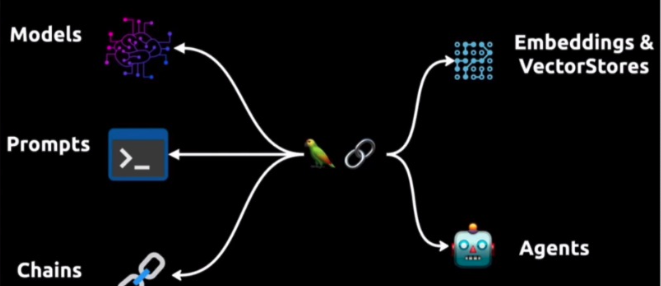
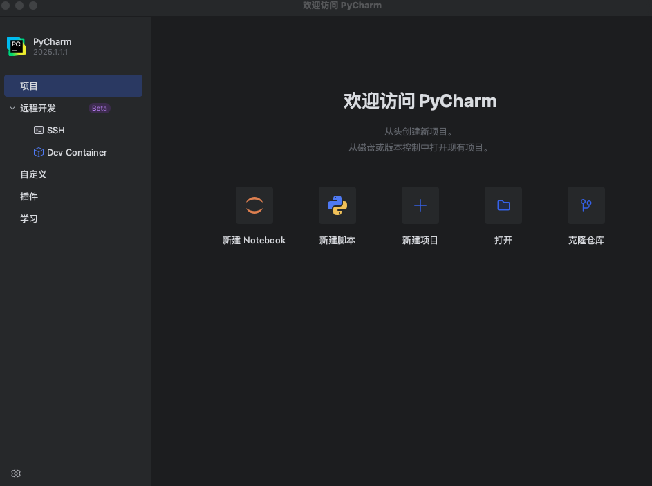
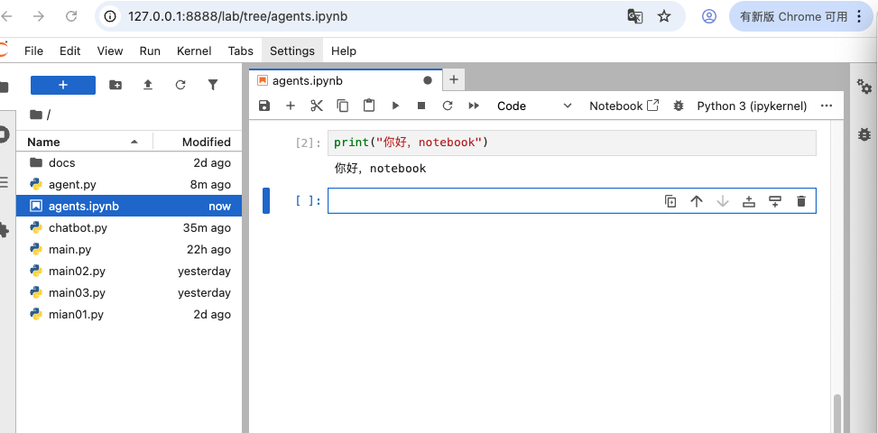
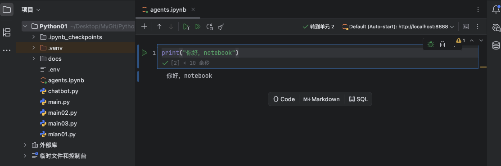
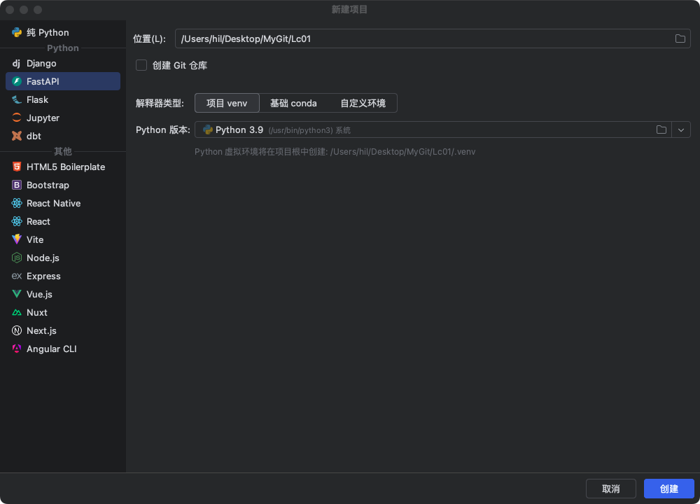
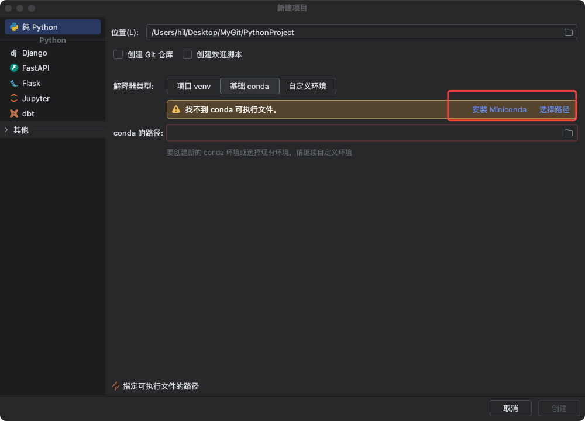
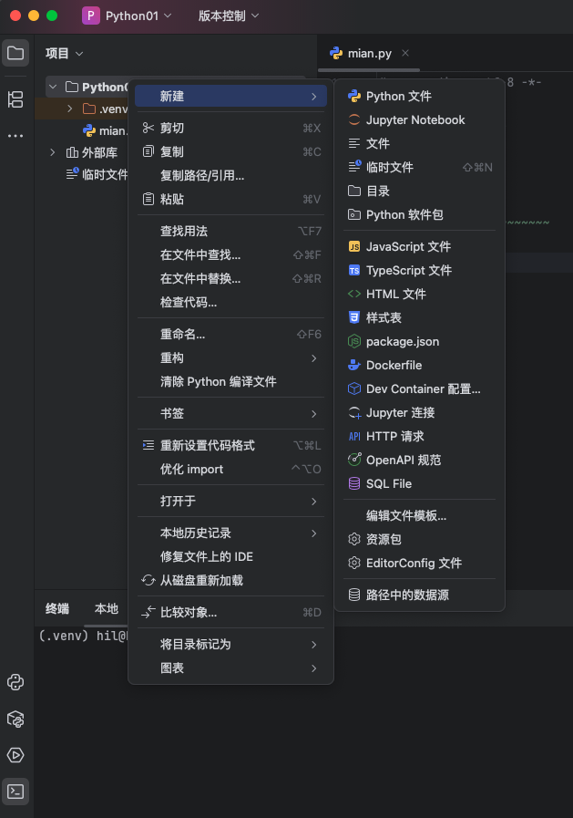
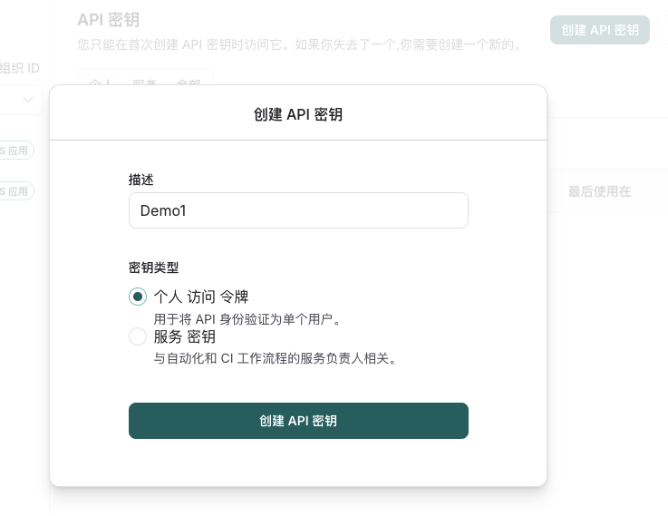
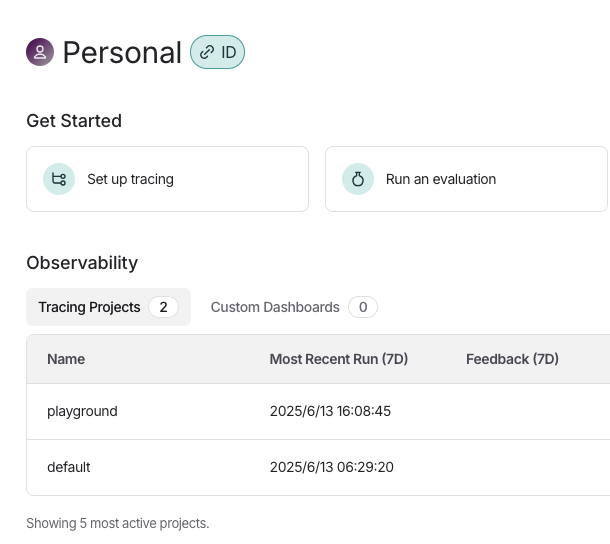
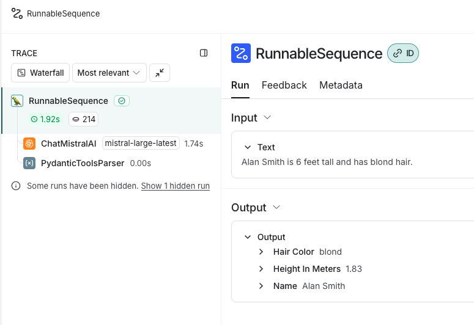

# LangChain
[LangChain](https://langchain.cadn.net.cn/python/docs/introduction/index.html)及[API文档](https://python.langchain.com/api_reference/langchain/index.html#)相关可供查阅。

LangChain社区支持库可在[此处查看](https://smith.langchain.com/hub)
其他开源社区：
[魔搭社区](https://modelscope.cn/home)
[Hugging Face](https://huggingface.co)

术语：
1. LLM 大语言模型
2. RAG 检索增强生成
3. NLP 自然语言处理
4. AIGC AI生成内容
5. Agent 智能体
6. AGI 通用人工智能
7. ROS (Robot Operating System)[机器人操作系统](wiki.ros.org)



**Langchain的核心**
* 模型 Models：包装器允许你连接到大型语言模型，如GPT-4 或 Hugging Face 也包括GLM 提供的模型
* Prompt Templates：这些模板让你避免硬编码文本输入。你可以动态地将用户输入插入到模板中，并发送给语言模型
* Chains：链允许你将多个组件组合在一起，解决特定的任务，并构建完整的语言模型应用程序
* Agents：代理允许语言模型与外部API交互
* Embedding 嵌入与向量存储 Vectorstore 是数据表示和检索的手段，为模型提供必要的语言理解基础
* Indexes：索引帮助你从语言模型中提取相关信息

## PyCharm 安装
我们使用PyCharm来学习[没有下载的可以看这里](https://www.jianshu.com/p/355c7f55238b)。安装完成后，打开：


如果运行简单脚本，可以新建Notebook文件，运行Notebook可以启动一个`http://127.0.0.1:8888/`服务，可以打开浏览器，在浏览器窗口编写代码，在线运行调试代码：



也可直接在pycharm IDE工作区查看，如下：


我们使用新建项目


venv‌ 是 Python 中的一个模块，用于创建和管理虚拟环境。虚拟环境是一个隔离的空间，允许你在其中安装和管理 Python 包，而不会影响到系统中的其他Python环境。



[conda](https://www.anaconda.com/docs/getting-started/getting-started) 可以用来管理不同的 python 版本，类似nvm管理不同的node一样。如果想使用conda可以选择安装。

我们选择先选择纯Python->项目venv ->选择python版本，点击创建。

这将会创建一个空的项目，只有.venv文件夹，选中项目文件右键，新建Python 文件`main.py`。


编写代码：
```
# 这是一个简单的函数
def my_print(name):
    # 可以使用断点debug代码
    # print(name)
    print(f'Hi, {name}')

# 程序入口
if __name__ == '__main__':
    my_print('PyCharm')
```
点击运行或debug即可运行和调试程序。

## LangSmith
[LangSmith](https://smith.langchain.com)是一个用于构建LLM全流程工具和服务的平台，，帮助开发者构建、测试、评估和监控基于LangChain或其他LLM框架的应用程序。

* 调试与测试：通过记录langchain构建的大模型应用的中间过程，开发者可以更好地调整提示词等中间过程，优化模型响应。
* 评估应用效果：langsmith可以量化评估基于大模型的系统的效果，帮助开发者发现潜在问题并进行优化
* 监控应用性能：实时监控应用程序的运行情况，及时发现异常和错误，确保其稳定性和可靠性
* 数据管理与分析：对大语言模型此次的运行的输入与输出进行存储和分析，以便开发者更好地理解模型行为和优化应用。

[注册登录LangSmith](https://smith.langchain.com/settings), 选择设置然后选择API密钥，点击创建API密钥。


创建后copy密钥将其保存。

对于个人用户LangSmith有每月5000次记录是免费的，超出需要付费。

[配置环境变量](https://python.langchain.com/docs/tutorials/llm_chain/)，打开`~/.bashrc`或`~/.zshrc`,添加环境变量：
```
export LANGSMITH_TRACING="true"
export LANGSMITH_API_KEY="..."
export LANGSMITH_PROJECT="default"
```
其中`LANGSMITH_PROJECT`可登录LangSmith查看


添加完环境变量保存后，执行命令使其生效：
```
source ~/.bashrc
```

在项目中也可以添加`python-dotenv`库，将变量添加到`.env`文件中。

## LangChain的简单使用

用PyCharm打开之前我们新建的项目，打开终端执行：
```
pip install langchain
pip install langchain-openai
pip install python-dotenv
```
新建`.env`文件，配置环境变量。我们这里添加的openai的库所以配置需要配置`OPENAI_API_KEY`。
需要到[官网注册](https://platform.openai.com/docs/overview)申请(需vpn)。
```
def openai_chat():
    model = init_chat_model("gpt-4o-mini", model_provider="openai")
    messages = [
        SystemMessage("转换下面的内容从English到中文"),
        HumanMessage("hi!"),
    ]
    res = model.invoke(messages)
    print(res)
```
执行上面的方法，控制台输出：
```
content='你好！' additional_kwargs={'refusal': None} response_metadata={'token_usage': {'completion_tokens': 2, 'prompt_tokens': 21, 'total_tokens': 23, 'completion_tokens_details': {'accepted_prediction_tokens': 0, 'audio_tokens': 0, 'reasoning_tokens': 0, 'rejected_prediction_tokens': 0}, 'prompt_tokens_details': {'audio_tokens': 0, 'cached_tokens': 0}}, 'model_name': 'gpt-4o-mini-2024-07-18', 'system_fingerprint': 'fp_34a54ae93c', 'id': 'chatcmpl-BhvC4miHahj6T1Ubf5dAWLD6BFsK9', 'service_tier': 'default', 'finish_reason': 'stop', 'logprobs': None} id='run--8055b9d7-633d-4901-91fb-892d08612f0d-0' usage_metadata={'input_tokens': 21, 'output_tokens': 2, 'total_tokens': 23, 'input_token_details': {'audio': 0, 'cache_read': 0}, 'output_token_details': {'audio': 0, 'reasoning': 0}}
```

LangSmith日志:


ChatModels 接收[消息](https://python.langchain.com/docs/concepts/messages/)对象作为输入，并生成消息对象作为输出。除了文本内容之外，消息对象还传达会话[角色](https://python.langchain.com/docs/concepts/messages/#role)并保存重要数据.
LangChain还支持通过字符串或 [OpenAI格式](https://langchain.cadn.net.cn/python/docs/concepts/messages/index.html#openai-format)输入聊天模型。以下是等效的：

```
model.invoke("Hello")

model.invoke([{"role": "user", "content": "Hello"}])

model.invoke([HumanMessage("Hello")])
```

聊天模型[流式输出](https://python.langchain.com/docs/how_to/chat_streaming/):
```
for token in model.stream(messages):
    print(token.content, end="|")
```
打印结果如下：
```
|你好|！|有什么|我|可以|帮助|你|的吗|？||
```
我将模型"gpt-4o-mini"改为"gpt-3.5-turbo"则报错：
openai.RateLimitError: Error code: 429 - 
{'error': {'message': 'You exceeded your current quota, please check your plan and billing details.',
           'type': 'insufficient_quota',
           'param': None,
           'code': 'insufficient_quota'}}
是OpenAI API 的配额限制错误。查看配额没有超，且`gpt-4o-mini`是可用的。
可能原因说明：
* 账户使用限额即额度用完
* API请求频率过高
* 提示词过长
* 返回token数超出最大值

相关单位表达
1. TPM: 每分钟token数
2. TPD: 每天允许使用的最大Token数量
3. RPM: 每分钟的请求数
4. RPD: 每天允许的请求数

最终还是没有找到问题原因？？

### 提示模板
[提示模板](https://python.langchain.com/docs/concepts/prompt_templates/)是LangChain中的一个概念，旨在协助进行这种转换。它们接收原始用户输入并返回准备传递到语言模型的数据.
`ChatPromptTemplate`模版对象支持在单个模板中使用多个消息角色。例如：
```
system_template = "Translate the following from English into {language}"

prompt_template = ChatPromptTemplate.from_messages(
    [("system", system_template), ("user", "{text}")]
)
```
system_template添加到系统消息中,其中`{language}`作为模版参数。
`{text}`作为用户消息的参数。
单独使用这个提示模板:
```
prompt = prompt_template.invoke({"language": "Chinese", "text": "Good morning!"})
```
输出：messages=[SystemMessage(content='Translate the following from English into Chinese', additional_kwargs={}, response_metadata={}), HumanMessage(content='Good morning!', additional_kwargs={}, response_metadata={})]

我们可以看出模版对象中定义的字段就是参数字典中的key，值则为对应key对应的值。
事例代码：
```
def prompt_temp(text="Good morning!", language="Chinese"):
    model = init_chat_model("gpt-4o-mini", model_provider="openai")
    # system_template = "转换下面的内容从中文到{language}"
    system_template = "Translate the following from English into {language}"
    prompt_template = ChatPromptTemplate.from_messages(
        [("system", system_template), ("user", "{text}")]
    )
    prompt = prompt_template.invoke({"language": language, "text": text})
    # 格式化消息
    prompt.to_messages()
    # 调用 chat 模型
    response = model.invoke(prompt)
    print(response.content)
```

## 构建语义搜索引擎
添加依赖库用于pdf加载,[更多文档加载器](https://langchain.cadn.net.cn/python/docs/integrations/document_loaders/index.html)可看这里
```
pip install langchain-community pypdf
```
LangChain内部核心库实现了Document文档抽象对象,即Document有三个属性：
* `page_content`: 表示内容的字符串
* `metadata`: 包含文档数据信息`source`，用字典表示
* `id`: 可选）文档的字符串标识符

加载`Document`对象,
```
def load_pdf_doc():
    file_path = "./docs/nke-10k-2023.pdf"
    loader = PyPDFLoader(file_path)
    docs = loader.load()
    # pdf有多少页
    print(len(docs))
    # 获取第一页前200字符
    print(f"{docs[0].page_content[:200]}\n")
    # 获取第一页元数据信息
    print(docs[0].metadata) 
    # 打印元数据信息: {'producer': 'EDGRpdf Service w/ EO.Pdf 22.0.40.0', 'creator': 'EDGAR Filing HTML Converter', 'creationdate': '2023-07-20T16:22:00-04:00', 'title': '0000320187-23-000039', 'author': 'EDGAR Online, a division of Donnelley Financial Solutions', 'subject': 'Form 10-K filed on 2023-07-20 for the period ending 2023-05-31', 'keywords': '0000320187-23-000039; ; 10-K', 'moddate': '2023-07-20T16:22:08-04:00', 'source': './docs/nke-10k-2023.pdf', 'total_pages': 107, 'page': 0, 'page_label': '1'}

```

接下来使用[文本拆分器](https://langchain.cadn.net.cn/python/docs/concepts/text_splitters/index.html)拆分PDF文档对象，用于信息检索和上下文问答目的。拆分重叠200字符保持上下文的连贯性。
```
def split_pdf_doc():
    file_path = "./docs/nke-10k-2023.pdf"
    loader = PyPDFLoader(file_path)
    docs = loader.load()
    # add_start_index=True 保留元数据属性
    text_splitter = RecursiveCharacterTextSplitter(
        chunk_size=1000, chunk_overlap=200, add_start_index=True
    )
    all_splits = text_splitter.split_documents(docs)

    print(len(all_splits))
```

### Embeddings嵌入
[Embeddings嵌入](https://langchain.cadn.net.cn/python/docs/concepts/embedding_models/index.html)是检索系统的核心。嵌入模型将人类语言转换为机器可以理解的格式，并可以快速准确地进行比较。 这些模型将文本作为输入，并生成一个固定长度的数字数组，即文本语义的数字指纹。 嵌入允许搜索系统不仅根据关键字匹配，而且根据语义理解来查找相关文档。

给定一个查询，我们可以将其嵌入为相同维度的向量，并使用向量相似度指标（例如余弦相似度）来识别相关文本。

LangChain支持的嵌入模型[可以看这里](https://langchain.cadn.net.cn/python/docs/integrations/text_embedding/index.html)。

在执行：
```
# 加载嵌入模型
embeddings = OpenAIEmbeddings(model="text-embedding-3-large")
vector_1 = embeddings.embed_query(all_splits[0].page_content)
vector_2 = embeddings.embed_query(all_splits[1].page_content)
#
assert len(vector_1) == len(vector_2)
print(f"Generated vectors of length {len(vector_1)}\n")
print(vector_1[:10])
```
使用`text-embedding-3-large`一直返回一下子错误：
```
{
    "error": {
        "message": "You exceeded your current quota, please check your plan and billing details.",
        "type": "insufficient_quota",
        "param": null,
        "code": "insufficient_quota"
    }
}
```
好吧，没有余额了。我只能切换使用其他模型，可以使用`langchain-core`自带的`DeterministicFakeEmbedding`。我们这里使用`llama3`:
```
pip install langchain-ollama
```
安装[ollama](https://ollama.com/download),`ollama pull llama3`安装本地llama3模型,可能需要花一些时间。

```
# 加载嵌入模型
    # embeddings = DeterministicFakeEmbedding(size=4096)
    embeddings = OllamaEmbeddings(model="llama3")
    vector_1 = embeddings.embed_query(all_splits[0].page_content)
    vector_2 = embeddings.embed_query(all_splits[1].page_content)
    #
    assert len(vector_1) == len(vector_2)
    print(f"Generated vectors of length {len(vector_1)}\n")
    print(vector_1[:10])
    # [np.float64(0.7926341431206548), np.float64(-0.2812335879080366), np.float64(-0.10753613121424813), np.float64(0.3154027699615671), np.float64(-0.1859997540042947), np.float64(0.3255190366031182), np.float64(1.114889943253859), np.float64(-0.6823437996276469), np.float64(-0.5607505304952727), np.float64(0.8247465179470694)]
    # llama
    # [-0.0043087127, -0.029127879, -0.01385499, 0.0040667765, -0.005861809, -0.02568284, -0.0069189444, -0.006874306, -0.034442145, -0.00085926877]
```
不同的嵌入模型生成的值也各不相同。

### VectorStore矢量存储
VectorStore通常使用嵌入模型进行初始化，嵌入模型确定如何将文本数据转换为数字向量。LangChain可以与[不同向量存储技术的集成（数据库、云提供商、内存等）](https://langchain.cadn.net.cn/python/docs/integrations/vectorstores/index.html)。
所有向量存储都可以强制转换为Retriever检索器。

VectorStore 包括用于查询的方法:
* 同步和异步;
* 按字符串查询和按向量;
* 返回和不返回相似性分数;
* 通过相似性和最大边际相关性（平衡检索结果中的相似性和查询多样性）。

嵌入向量通常将文本表示为“密集”向量，以便具有相似含义的文本在几何上接近。这样，我们只需传入一个问题即可检索相关信息，而无需了解文档中使用的任何特定关键术语。

```
embeddings = OllamaEmbeddings(model="llama3")
vector_store = InMemoryVectorStore(embeddings)
# 为文档编制索引
ids = vector_store.add_documents(documents=all_splits)
print(ids)
```
内存矢量存储调用`add_documents`后一直没有结果返回。将模型改为ollama支持的嵌入模型`nomic-embed-text`，则可以快速输出结果。

```
# 根据与字符串查询的相似性返回文档
results = vector_store.similarity_search(
    "How many distribution centers does Nike have in the US?"
)
print(results[0])
# 异步查询：
results = await vector_store.asimilarity_search("When was Nike incorporated?")
print(results[0])

# 返回分数
results = vector_store.similarity_search_with_score("What was Nike's revenue in 2023?")
doc, score = results[0]
print(f"Score: {score}\n")
print(doc)
```

### Retriever检索器
`VectorStore`不是`Runnable`的子类。`Retriever`是`Runnable`的子类，所以它们实现了`invoke`和`batch`的同步和异步方法。

```
# k=1 表示检索到的第一个数据
@chain
def retriever(query: str) -> List[Document]:
    return vector_store.similarity_search(query, k=1)


retriever.batch(
    [
        "How many distribution centers does Nike have in the US?",
        "When was Nike incorporated?",
    ],
)
```

`VectorStore`通过`as_retriever`转换为retriever。检索器包括特定的`search_type`和`search_kwargs`属性，这些属性标识要调用的基础向量存储的方法，以及如何参数化它们。

例如：
```
retriever = vector_store.as_retriever(
    # 类型相似
    search_type="similarity",
    # 分值最相似的数据
    search_kwargs={"k": 1},
)

retriever.batch(
    [
        "How many distribution centers does Nike have in the US?",
        "When was Nike incorporated?",
    ],
)
```

## 文本分类打标
文本分类标记如下：
* 情绪
* 语言
* 风格（正式、非正式等）
* 涵盖的主题
* 政治趋势

也可以使用[元数据标记器](https://langchain.cadn.net.cn/python/docs/integrations/document_transformers/openai_metadata_tagger/index.html)，标记有几个组成部分:
* `function`: 标记使用函数来指定模型应如何标记文档
* `schema`: 定义想要如何标记文档

schema标记文档
```
# 文本分类
def text_category():
    #  初始化模型
    llm = init_chat_model("gpt-4o-mini", model_provider="openai")
    # 提示词模版
    tagging_prompt = ChatPromptTemplate.from_template(
    """
    从以下段落中提取所需信息. 仅提取'Schema'方法中提到的属性. Passage: {input}
    """
    )
    # 结构化模型
    structured_llm = llm.with_structured_output(Schema)
    # 输入需要分类的文本
    in_put = "我很高兴认识你！我想我们会成为非常好的朋友！"
    # in_put= "Estoy muy enojado con vos! Te voy a dar tu merecido!"
    prompt = tagging_prompt.invoke({"input": in_put})
    # 执行返回响应
    response = structured_llm.invoke(prompt)
    # 将模型转字典结构
    res = response.model_dump()
    print(res)

class Schema(BaseModel):
    # The sentiment of the text
    sentiment: str = Field(description="文本的情感")
    # 文本的攻击性程度从1到10
    aggressiveness: int = Field(description="How aggressive the text is on a scale from 1 to 10")
    # 文本所使用的语言
    language: str = Field(description="The language the text is written in")
```
输出结果：`{'sentiment': '积极', 'aggressiveness': 1, 'language': '中文'}`，另一输出`{'sentiment': '生气', 'aggressiveness': 8, 'language': '西班牙语'}`

我们得到了不同语言和情绪(“正面”、“负面”) 。
为了更好地控制模型的输出，我们需要对`schema`定义细化Pydantic 模型。确保：
1. 每个属性的可能值
2. Description以确保模型理解属性
3. 要返回的必需属性。

重新定义Schema类:
```
class SentimentEnum(str, Enum):
    happy = "happy"
    neutral = "neutral"
    sad = "sad"

class LanguageEnum(str, Enum):
    chinese="汉语"
    english="英语"
    spanish="西班牙语"
    french="法语"
    german="德语"
    italian="意大利语"

class Schema(BaseModel):
    sentiment: SentimentEnum = Field(description="The sentiment of the text")
    # 描述陈述的攻击性，数字越高，攻击性越强
    aggressiveness: Literal[1, 2, 3, 4, 5, 6, 7, 8, 9, 10] = Field(
        description="describes how aggressive the statement is, the higher the number the more aggressive",
    )
    language: LanguageEnum = Field(description="The language the text is written in")
```
输出结果：
```
{'sentiment': <SentimentEnum.happy: 'happy'>, 'aggressiveness': 1, 'language': <LanguageEnum.chinese: '汉语'>}
```

## 提取
提取所需要的信息需要使用`schema`进行描述。
例如提取个人信息：
```
def info_retrieval():
    llm = init_chat_model("gpt-4o-mini", model_provider="openai")
    # 结构化模型
    structured_llm = llm.with_structured_output(Person)
    # 提示词模版
    prompt_template = ChatPromptTemplate.from_messages(
        [
            (
                "system",
                "You are an expert extraction algorithm. "
                "Only extract relevant information from the text. "
                "If you do not know the value of an attribute asked to extract, "
                "return null for the attribute's value.",
            ),
            # 请参阅如何通过参考示例提高性能。
            # MessagesPlaceholder('examples'),
            ("human", "{text}"),
        ]
    )
    # 输入文本
    text = "Alan Smith is 6 feet tall and has blond hair."
    prompt = prompt_template.invoke({"text": text})
    # 根据提示器返回响应
    response = structured_llm.invoke(prompt)
    # 将模型转字典结构
    res = response.model_dump()
    print(res)
```
打印信息：`{'name': 'Alan Smith', 'hair_color': 'blond', 'height_in_meters': '1.83'}`

LangSmith[跟踪chat model](https://smith.langchain.com/public/44b69a63-3b3b-47b8-8a6d-61b46533f015/r)显示了发送到模型的消息、调用的工具和其他元数据的确切顺序。


在多数情况下我们不是提取单个实体，而是提取实体列表。
```
class Data(BaseModel):
    """Extracted data about people."""
    # 创建一个模型，以便我们可以提取多个实体。
    people: List[Person]
    
# 结构化模型时传入Data
structured_llm = llm.with_structured_output(Data)
# 修改text文本
text = "My name is Jeff, my hair is black and i am 6 feet tall. Anna has the same color hair as me."
```
打印结果如下：
```
{'people': 
    [
        {'name': 'Jeff', 'hair_color': 'black', 'height_in_meters': '1.83'},
        {'name': 'Anna', 'hair_color': 'black', 'height_in_meters': None}
    ]
}
```
 它提取了多个实体信息。
 
 ## 工具调用`tool calling`或`function calling`
 模型与系统API交互时，则需要使用[工具调用](https://langchain.cadn.net.cn/python/docs/how_to/index.html#tools)来请求与特定架构匹配的模型响应。
 
 工具调用的一个关键原则是，模型根据输入的相关性决定何时使用工具。模型并不总是需要调用工具。例如，给定一个不相关的输入"Hello world!"，模型不会调用该工具,模型将以自然语言做出的响应。
 如果调用了该工具`result`将具有`tool_calls`属性，此属性包括执行工具所需的一切，包括工具名称和输入参数。
 ```
 def tool_call():
    llm = init_chat_model("gpt-4o-mini", model_provider="openai")
    # Tool列表
    tools_list = [multiply]
    # 工具绑定
    llm_with_tools = llm.bind_tools(tools_list)
    # 用户输入
    user_input = "Hello world!"
    user_input = "What is 2 multiplied by 3?"
    # 工具回调
    result = llm_with_tools.invoke(user_input)
    print(result)
    print(result.tool_calls)
    if hasattr(result, "tool_calls") and result.tool_calls:
        for tool_call in result.tool_calls:
            tool_name = tool_call["name"]
            args = tool_call["args"]
            tool_call_id = tool_call["id"]
            if tool_name == "multiply":
                tool_response = multiply.invoke(args)
                print(f"{tool_name}结果: {tool_response}")
                # 可选：将工具执行结果反馈给模型，让它生成自然语言回答
                final_messages = [
                    HumanMessage(content=user_input),
                    result,
                    ToolMessage(
                        tool_call_id=tool_call_id,
                        content=str(tool_response)  # 工具执行结果
                    )
                ]
                final_answer = llm.invoke(final_messages)
                print(final_answer.content)
 ```
打印结果:
```
// result.tool_calls
[{'name': 'multiply', 'args': {'a': 2, 'b': 3}, 'id': 'xxx', 'type': 'tool_call'}]
multiply结果: 6
2 multiplied by 3 is 6.
```
 
 在设计模型要使用的工具时，请务必记住：
 
 * 具有显式工具调用 API 的模型将比非微调模型更擅长工具调用
 * 如果工具具有精心选择的名称和描述，则模型的性能会更好
 * 简单、范围狭窄的工具比复杂的工具更容易被模型使用
 * 要求模型从大量工具中进行选择会给模型带来挑战