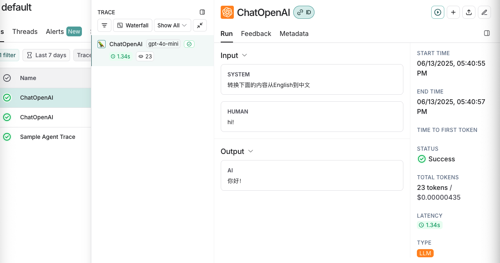

# LangChain

## PyCharm 安装
我们使用PyCharm来学习[没有下载的可以看这里](https://www.jianshu.com/p/355c7f55238b)。安装完成后，打开：


新建项目


venv‌ 是 Python 中的一个模块，用于创建和管理虚拟环境。虚拟环境是一个隔离的空间，允许你在其中安装和管理 Python 包，而不会影响到系统中的其他Python环境。


[conda](https://www.anaconda.com/docs/getting-started/getting-started) 可以用来管理不同的 python 版本，类似nvm管理不同的node一样。如果想使用conda可以选择安装。

我们选择先选择纯Python->项目venv ->选择python版本，点击创建。

这将会创建一个空的项目，只有.venv文件夹，选中项目文件右键，新建Python 文件`main.py`。


编写代码：
```
# 这是一个简单的函数
def my_print(name):
    # 可以使用断点debug代码
    # print(name)
    print(f'Hi, {name}')

# 程序入口
if __name__ == '__main__':
    my_print('PyCharm')
```
点击运行或debug即可运行和调试程序。

## LangSmith
[LangSmith](https://smith.langchain.com)是一个用于构建LLM全流程工具和服务的平台，，帮助开发者构建、测试、评估和监控基于LangChain或其他LLM框架的应用程序。

* 调试与测试：通过记录langchain构建的大模型应用的中间过程，开发者可以更好地调整提示词等中间过程，优化模型响应。
* 评估应用效果：langsmith可以量化评估基于大模型的系统的效果，帮助开发者发现潜在问题并进行优化
* 监控应用性能：实时监控应用程序的运行情况，及时发现异常和错误，确保其稳定性和可靠性
* 数据管理与分析：对大语言模型此次的运行的输入与输出进行存储和分析，以便开发者更好地理解模型行为和优化应用。

[注册登录LangSmith](https://smith.langchain.com/settings), 选择设置然后选择API密钥，点击创建API密钥。


创建后copy密钥将其保存。

对于个人用户LangSmith有每月5000次记录是免费的，超出需要付费。

[配置环境变量](https://python.langchain.com/docs/tutorials/llm_chain/)，打开`~/.bashrc`或`~/.zshrc`,添加环境变量：
```
export LANGSMITH_TRACING="true"
export LANGSMITH_API_KEY="..."
export LANGSMITH_PROJECT="default"
```
其中`LANGSMITH_PROJECT`可登录LangSmith查看


添加完环境变量保存后，执行命令使其生效：
```
source ~/.bashrc
```

在项目中也可以添加`python-dotenv`库，将变量添加到`.env`文件中。

## LangChain的简单使用

用PyCharm打开之前我们新建的项目，打开终端执行：
```
pip install langchain
pip install langchain-openai
pip install python-dotenv
```
新建`.env`文件，配置环境变量。我们这里添加的openai的库所以配置需要配置`OPENAI_API_KEY`。
```
def openai_chat():
    model = init_chat_model("gpt-4o-mini", model_provider="openai")
    messages = [
        SystemMessage("转换下面的内容从English到中文"),
        HumanMessage("hi!"),
    ]
    res = model.invoke(messages)
    print(res)
```
执行上面的方法，控制台输出：
```
content='你好！' additional_kwargs={'refusal': None} response_metadata={'token_usage': {'completion_tokens': 2, 'prompt_tokens': 21, 'total_tokens': 23, 'completion_tokens_details': {'accepted_prediction_tokens': 0, 'audio_tokens': 0, 'reasoning_tokens': 0, 'rejected_prediction_tokens': 0}, 'prompt_tokens_details': {'audio_tokens': 0, 'cached_tokens': 0}}, 'model_name': 'gpt-4o-mini-2024-07-18', 'system_fingerprint': 'fp_34a54ae93c', 'id': 'chatcmpl-BhvC4miHahj6T1Ubf5dAWLD6BFsK9', 'service_tier': 'default', 'finish_reason': 'stop', 'logprobs': None} id='run--8055b9d7-633d-4901-91fb-892d08612f0d-0' usage_metadata={'input_tokens': 21, 'output_tokens': 2, 'total_tokens': 23, 'input_token_details': {'audio': 0, 'cache_read': 0}, 'output_token_details': {'audio': 0, 'reasoning': 0}}
```

LangSmith日志:


ChatModels 接收[消息](https://python.langchain.com/docs/concepts/messages/)对象作为输入，并生成消息对象作为输出。除了文本内容之外，消息对象还传达会话[角色](https://python.langchain.com/docs/concepts/messages/#role)并保存重要数据.
LangChain还支持通过字符串或 [OpenAI格式](https://langchain.cadn.net.cn/python/docs/concepts/messages/index.html#openai-format)输入聊天模型。以下是等效的：

```
model.invoke("Hello")

model.invoke([{"role": "user", "content": "Hello"}])

model.invoke([HumanMessage("Hello")])
```

聊天模型[流式输出](https://python.langchain.com/docs/how_to/chat_streaming/):
```
for token in model.stream(messages):
    print(token.content, end="|")
```
打印结果如下：
```
|你好|！|有什么|我|可以|帮助|你|的吗|？||
```

## 提示模板
[提示模板](https://python.langchain.com/docs/concepts/prompt_templates/)是LangChain中的一个概念，旨在协助进行这种转换。它们接收原始用户输入并返回准备传递到语言模型的数据.