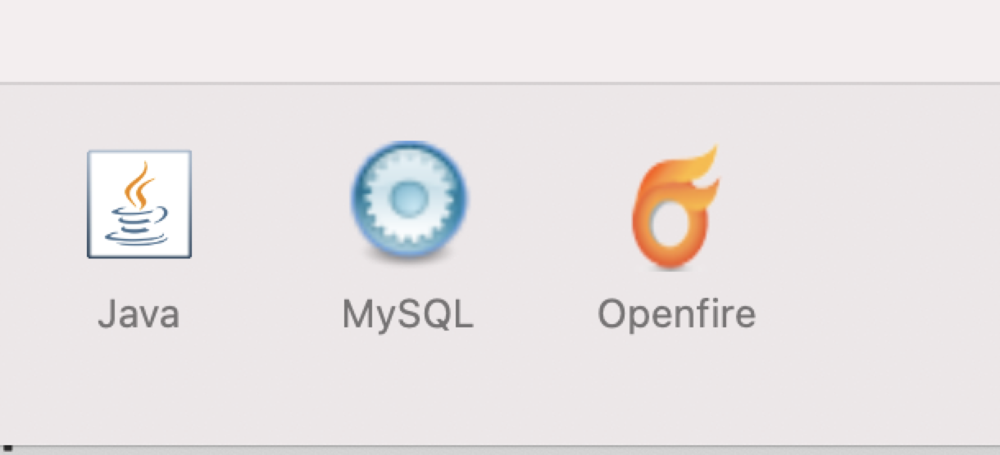

# XMPP简述

XMPP一个老掉牙的框架了，虽然古老，但对于我依然是很陌生的。

XMPP是基于XML的网络即时通讯协议。可以建立TPC/IP连接，完成C/S、C/C、S/S之间的数据传输。XMPP官网[https://xmpp.org/](http://xmpp.org)。


## Openfire服务器配置

打开官网选择Software->Servers，它有好几个服务器框架。我们选择Openfire。Openfire是一款经典的XMPP Server,用java编写并且开源。Openfire由XMPPServer+JavaWebServer组成，前者基于XMPP协议进行通信，后者是一个web管理后台。

**java环境安装：**

检查java版本
```
java -version
```
可以看到安装的信息：
```
java version "1.8.0_181"
Java(TM) SE Runtime Environment (build 1.8.0_181-b13)
Java HotSpot(TM) 64-Bit Server VM (build 25.181-b13, mixed mode)
```
没有安装Java环境，要首先[下载](http://www.oracle.com/technetwork/java/javase/downloads/)JDK8安装包。

**安装数据库**

我们首先下载MySQL数据库,下载[MySQL Community Server](http://www.mysql.com/downloads/)并进行安装。
安装后可以在设置中查看。
接着安装数据库管理工具[MySQLWorkbench](https://dev.mysql.com/downloads/workbench/)

使用GUI工具MySQLWorkbench进行数据库配置，配置前需开启服务器

1. 新建一个connection,并设置名称
2. 设置连接方式TCP/IP
3. 设置账号密码、host及端口号

**安装服务器**

下载[openfire](https://www.igniterealtime.org/downloads/#openfire) for mac。



打开报错：“Openfire”偏好设置存在错误。
原因：JAVA_HOME配置错误
解决：`/usr/libexec/java_home -V`查看JAVA_HOME路径，找到JDK安装目录`/Library/Java/JavaVirtualMachines/jdk1.8.0_181.jdk/Contents/Home`
		打开`/usr/local/openfire/bin`目录下的`openfire.sh`文件
		将`JAVA_HOME=/System/Library/Frameworks/JavaVM.framework/Home`替换为`JAVA_HOME=/Library/Java/JavaVirtualMachines/jdk1.8.0_181.jdk/Contents/Home`

然后终端执行`bash /usr/local/openfire/bin/openfire.sh`启动Openfire。
遗留问题：start fire 启动依然会报错，只能通过脚本启动。

安装后打开，点击`Open Admin Console`

1. 服务器设置：设置域名(例如：exsamle.test.cn)和端口(默认9090)
2. 数据库设置：标准数据库连接，使用外部连接。数据库驱动选择MySQL,


