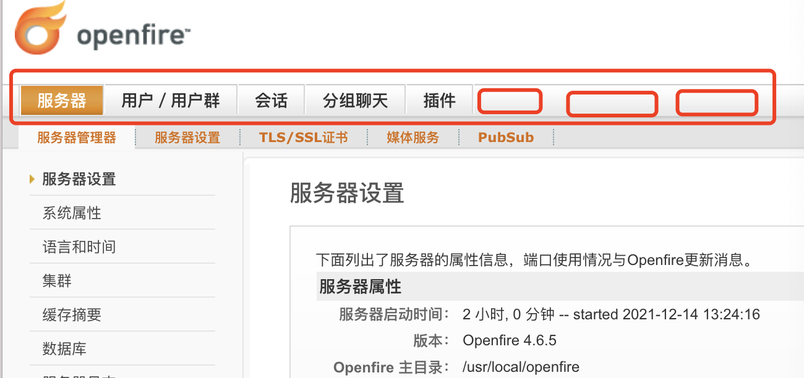
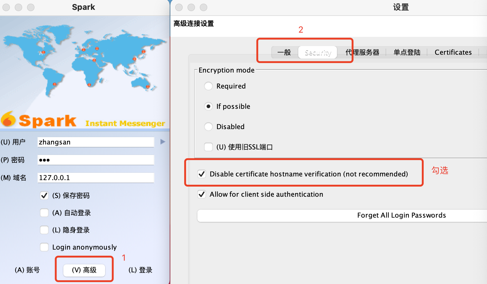

# XMPP简述

XMPP一个老掉牙的框架了，虽然古老，但对于我依然是很陌生的。

XMPP是基于XML的网络即时通讯协议。可以建立TPC/IP连接，完成C/S、C/C、S/S之间的数据传输。XMPP官网[https://xmpp.org/](http://xmpp.org)。


## Openfire服务器配置

打开官网选择Software->Servers，它有好几个服务器框架。我们选择Openfire。Openfire是一款经典的XMPP Server,用java编写并且开源。Openfire由XMPPServer+JavaWebServer组成，前者基于XMPP协议进行通信，后者是一个web管理后台。

**java环境安装：**

检查java版本
```
java -version
```
可以看到安装的信息：
```
java version "1.8.0_181"
Java(TM) SE Runtime Environment (build 1.8.0_181-b13)
Java HotSpot(TM) 64-Bit Server VM (build 25.181-b13, mixed mode)
```
没有安装Java环境，要首先[下载](http://www.oracle.com/technetwork/java/javase/downloads/)JDK8安装包。

**安装数据库**

我们首先下载MySQL数据库,下载[MySQL Community Server](http://www.mysql.com/downloads/)并进行安装。
安装后可以在设置中查看。
接着安装数据库管理工具[MySQLWorkbench](https://dev.mysql.com/downloads/workbench/)

使用GUI工具MySQLWorkbench进行数据库配置，配置前需开启服务器

1. 新建一个connection,并设置名称
2. 设置连接方式TCP/IP
3. 设置账号密码、host及端口号

**安装服务器**

下载[openfire](https://www.igniterealtime.org/downloads/#openfire) for mac。


打开报错：“Openfire”偏好设置存在错误。
原因：JAVA_HOME配置错误
解决：

1. `/usr/libexec/java_home -V`查看JAVA_HOME路径，找到JDK安装目录`/Library/Java/JavaVirtualMachines/jdk1.8.0_181.jdk/Contents/Home`
2. 打开`/usr/local/openfire/bin`目录下的`openfire.sh`文件copy至桌面
3. 将桌面的openfire.sh文件中的`JAVA_HOME=/System/Library/Frameworks/JavaVM.framework/Home`替换为`JAVA_HOME=/Library/Java/JavaVirtualMachines/jdk1.8.0_181.jdk/Contents/Home`
4. 用桌面的`openfire.sh`替换`/usr/local/openfire/bin`目录下的`openfire.sh`
5. 在`/Users/xxx/.zshrc`添加环境变量
	```
	export JAVA_HOME=/Library/Java/JavaVirtualMachines/jdk1.8.0_181.jdk/Contents/Home
	```
	

6. 然后终端执行`sudo bash /usr/local/openfire/bin/openfire.sh`启动Openfire。
遗留问题：start Openfire 启动依然会报错，只能通过脚本启动。

卸载指令：
```
sudo rm-rf/Library/PreferencePanes/Openfire.prefPane
sudo rm -rf /usr/local/openfire
sudo rm-rf/Library/LaunchDaemons/org.jivesoftware.openfire.plist

```

安装后打开，点击`Open Admin Console`
若报错：定义openfire安装目录或新建或增加openfire_init.xml文件到类路径
是没有操作权限导致的，在执行脚本时添加`sudo`


1. 服务器设置：设置域名(例如：exsamle.test.cn)和端口(默认9090)
2. 数据库设置：标准数据库连接，使用外部连接。数据库驱动选择MySQL,


连接数据库的时候报错：
```
A connection to the database could not be made. View the error message by opening the "/logs/error.log" log file, then go back to fix the problem. 
```
原因：我的是数据库名字设置错了，我用的gui工具连接是可以分组的，我写成了分组的名字

3. 外形设置
 
 

4. 管理员设置


此处我们设置密码为：admin和管理员账号一样，然后跳转到后台登录


openfire是开源的，基础功能如下,我们可以通过添加插件的方式来扩展其功能




## 服务器介绍

#### 服务器端口

服务器可用的端口号


例如：`telnet 127.0.0.1 5222` 发送消息但是并不会得到回应

#### 用户


#### 会话


#### 分组聊天


## 客户端安装

下载安装[Spark](https://www.igniterealtime.org/downloads/)一个客户端软件


使用服务器已有的账户进行登录。

登录报错如下


设置禁用证书主机名验证



登录成功后刷新后台用户列表可以看到用户为在线状态。

## JID

JID即JabberID,一个合法的jid是: username@hostname/extra组成(例如：zhangsan@im.qiu.com)

* jid(JabberID)对象分为三段:

1. username: 用户名
2. hostname: 主机域名
3. extra: 可选,设备名或资源名（用于多设备登录）

* bare只包含用户名和本地域的NSString,缺少资源类型
* full完整的jid的NSString,包含资源类型

添加好友


