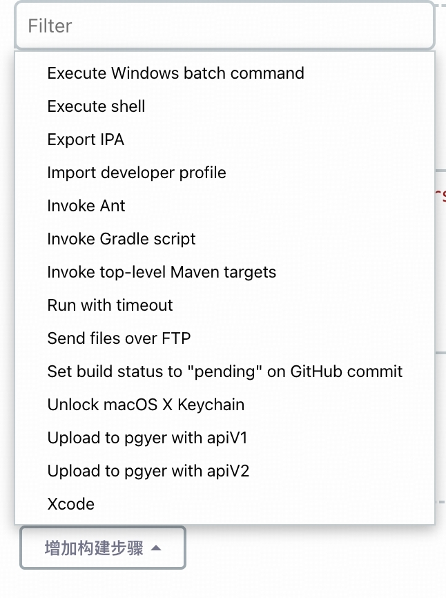

# Jinkens遇到的问题

## [Jinkens的安装和配置](https://www.bilibili.com/video/BV1zM41127hC/?spm_id_from=333.999.0.0&vd_source=9b0910a821dc69e8f6e87d1e96d7c20e)

* 安装JDK,配置环境变量
* 安装最新的LTS版本：`brew install jenkins-lts`
* 安装特定的LTS版本：`brew install jenkins-lts@YOUR_VERSION`
* 启动 Jenkins 服务：`brew services start jenkins-lts`
* 重新启动 Jenkins 服务：`brew services restart jenkins-lts`
* 更新 Jenkins 版本：`brew upgrade jenkins-lts`

## Jinkens创建item

项目item包括一下类型：

* 自由风格的项目
* maven项目
  * java后端微服务项目
* pipeline流水线
  * Jenkins Pipeline 纯脚本，效率高，但门槛高，配置可读性差，维护难。
* 多配置项目
* Organization Folder
* 文件夹
* 多分支流水线

下面以创建自由风格的项目为例：

#### 自由风格的项目

* 输入这个CI/CD的名字，会展示在列表中
* 描述：描述这个CI/CD的相关信息
* Discard old builds: 构建历史使用的策略，也可不使用
  * 保持构建的天数
  * 保持构建的最大个数
* Github项目：如果是Github项目可勾选这个输入对应的地址url
* 使用自定义的工作空间：没有用过
* Use alternative credential: 使用备用凭据，需要添加证书，没用过
* This project is parameterized: 添加项目参数，参数类型有很多，可根据需要选择
  * Git Parameter: git参数，例如：名称 `GitBranch` 描述 `选择一个分支` 参数类型选择 `分支` 默认值设置为`origin/master`。
  * Choice Parameter: 选择性参数，例如：名称 `Protective` 选项`No` `Yes`  描述 `No: 不防护 Yes: 加固防护`
* 源码管理 -> Git:  配置源码仓库地址及账号登陆凭证。
  * Branches to build: 指定分支，可写死固定分支，也可使用在`This project is parameterized`时添加的环境变量`$GitBranch`,即表示选择的分支的名称。
  * Additional Behaviours: 额外的行为，可设置请求超时时间。
* 构建触发器：在此处可以选择自动构建触发的方式，例如 当有push操作时自动触发构建操作
* 构建环境：做一些配置操作，没用过
* Build Steps: 构建步骤
  * 在此处可以添加需要的构建步骤，例如： 选择`Execute shell`来添加构建脚本并且可以使用在`This project is parameterized`时添加的环境变量`$Protective`等，其他选项如下：
    
* 构建后操作：构建完成后需要做的操作
  

## 遇到的问题

### 项目过大拉取代码超时

1. 在当前的构建任务下
2. 点击配置
3. 选择源码管理
4. 在git下点击新增
5. 选择Advanced clone behaviours
6. 将克隆和拉取超时时间设置为30， 默认10
7. 指定分支为`$GitBranch`时，构建时可选择分支

### 在脚本导出包时报错
`error: exportArchive: No signing certificate "iOS Development" found`

1. 检查证书和配置文件
2. 检查`ExportOptions.plist`文件，因为我们账户发生变化，teamid需要也需要修改

### xcrun altool验证ipa包不通过

1. 因为账号发生变更，`apiKey`和`apiIssuer`需要重新获取
2. 登录app connect > 用户和访问 > 集成 > 密钥 > App Store Connect API(只有账户持有人可以请求访问) > 生成密钥， 从而重新获取`apiKey`和`apiIssuer`
3. 下载api密钥`.p8`文件，将其放置到`~/private_keys`目录下

