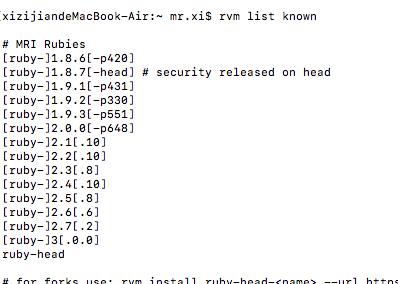
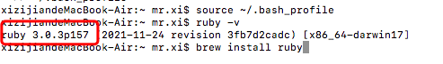

# RN环境搭建 及 CocoaPods 安装踩坑之路

*今天本打算搭建个RN+ts项目做一些小demo，没想到官方文档第一步就开始报错，总结归纳一下今天遇到的问题吧*

#### 1.sudo gem install cocoapods报错

```
Could not find a valid gem 'cocoapods' (>= 0), here is why:
          Unable to download data from https://gems.ruby-china.org/ - no such name (https://gems.ruby-china.org/specs.4.8.gz)
```

原因是需要rubygems.org源来下载specs.4.8.gz

执行这段命令解决：``` sudo gem install cocoapods --source http://rubygems.org```


#### 2.ERROR:  Error installing cocoapods:
	zeitwerk requires Ruby version >= 2.5.  报错


显示Ruby等级太低了，接下来 ruby-v 发现 版本为2.3.7 ，不符合要求

升级Ruby 执行  ```rvm list known```  提示command not found 请先安装rvm

``` curl -L get.rvm.io | bash -s stable```

这是成功已经安装好了rvm 再执行rvm list known 可以看到所有可以安装的ruby版本，如图：




接下来就可以下升级ruby了(可算回到主线了) 中途发现了些问题，使用rvm升级ruby的话需要升级系统，所以临时改用了brew 升级ruby

执行命令``` brew install ruby```


#### 3.Error: Xcode alone is not sufficient on High Sierra.
Install the Command Line Tools:
  xcode-select --install


安装``` xcode-select --install```  验证是否成功``` xcode-select -p```

执行完 `brew install ruby` 命令后，ruby -v后其实还是原来的版本👌，这是因为环境变量没有配置。因此，还有一个步骤就是配置环境变量。

执行以下两步就OK了


``` echo 'export PATH="/usr/local/opt/ruby/bin:$PATH"' >> ~/.bash_profile ```

``source ~/.bash_profile ``

执行后，查看版本后，会判断已更新到最新版本。



