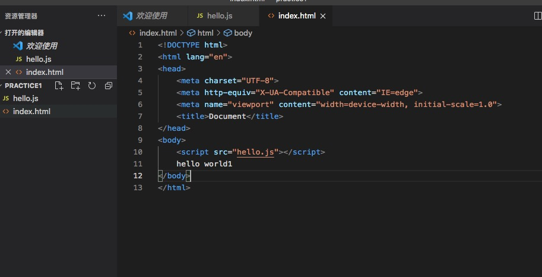

# Html快速创建项目调试


### 1.创建文件夹及文件hello.js、index.html




### 2.调试

默认支持node调试，F5启动调试,若要支持网页调试，需安装Debugger for Chrome，如下是基本配置方式(该文件在F5运行时选择Chrome会自动生成launch.json文件)

```
{
    // 使用 IntelliSense 了解相关属性。 
    // 悬停以查看现有属性的描述。
    // 欲了解更多信息，请访问: https://go.microsoft.com/fwlink/?linkid=830387
    "version": "0.2.0",
    "configurations": [
        {
            "type": "chrome",
            "request": "launch",
            "name": "Launch Chrome against localhost",
            "url": "http://localhost:8080",
            "webRoot": "${workspaceFolder}/wwwroot"
        },
        {
            "name": "Launch index.html",
            "type": "chrome",
            "request": "launch",
            "file": "${workspaceFolder}/index.html"
        },
    ]
}

```


### 3.安装及运行搭建http-server服务

```
npm install http-server
```

安装成功后 执行 http-server 成功如图所示：


点击进入即可进行调试
