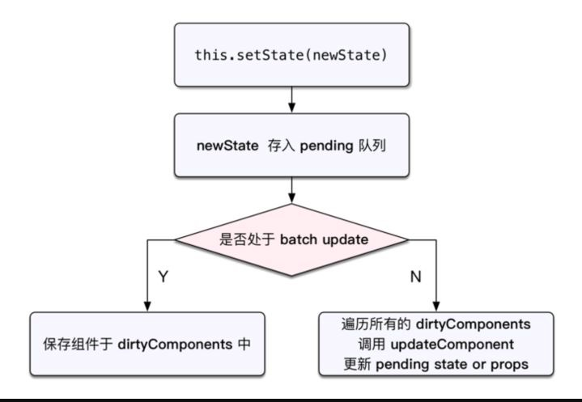

## React 中setState更新state何时同步何时异步？

从下面代码的运行结果可以得出如下结论：

- **React控制之外的事件中调用setState是同步更新的。比如原生js绑定的事件，setTimeout/setInterval等**。
- **由React控制的事件处理程序，以及生命周期函数调用setState不会同步更新state，也就是所谓的“异步”** 。
- 在合成事件和生命周期中，如果对同一个值进行多次`setState`，`setState`的批量更新策略会对其进行覆盖，取最后一次的执行

```javascript
class App extends React.Component {

  constructor () {
    super();
    this.state = {
      counter: 0
    };
  }

  componentDidMount() {
    // 生命周期中调用
    console.log("componentDidMount before: " + this.state.counter);
    this.setState({ counter: this.state.counter + 1 });
    // 此处不能实时更新
    console.log("componentDidMount after: " + this.state.counter);
    setTimeout(() => {
      // setTimeout中调用
      console.log("setTimeout before: " + this.state.counter);
      this.setState({ counter: this.state.counter + 1 });
      console.log("setTimeout after: " + this.state.counter);
    }, 0);
    document.getElementById("btn-2").addEventListener("click", this.btn2Click);
  }


  spanClick = () => {
    const { counter } = this.state;
    console.log("spanClick before: " + this.state.counter);
    this.setState({
      counter: counter + 1
    })
    this.setState({
      counter: counter + 2
    })
    // 此处不能实时更新
    console.log("spanClick after: " + this.state.counter);
  }

  btn2Click = () => {
    const { counter } = this.state;
    console.log("addEventListener btn2Click before: " + this.state.counter);
    this.setState({
      counter: counter + 1
    })
    // 此处可以实时更新
    console.log("addEventListener btn2Click after: " + this.state.counter);
  }

  render () {
    return (
    <div className="App">
      <span className="btn" onClick={(event) => this.spanClick(event)}>
        点击
      </span>
      <span className="btn-2" id="btn-2">
        点击2
      </span>
    </div>
    )};
}

// 打印结果。before与after相同即为“异步”，否则为同步
// componentDidMount before: 0
// componentDidMount after: 0
// setTimeout before: 1
// setTimeout after: 2
// spanClick before: 2
// spanClick after: 2
// addEventListener btn2Click before: 4
// addEventListener btn2Click after: 5

```

### React是怎样控制异步和同步的呢？

在 React 的 setState 函数实现中，会根据一个变量 isBatchingUpdates 判断是直接更新 this.state 还是放到队列中延时更新，而 isBatchingUpdates 默认是 false，表示 setState 会同步更新 this.state；但是，有一个函数 batchedUpdates，该函数会把 isBatchingUpdates 修改为 true，而当 React 在调用事件处理函数之前就会先调用这个 batchedUpdates将isBatchingUpdates修改为true，这样由 React 控制的事件处理过程 setState 不会同步更新 this.state。




### 多个setState调用会合并处理

```javascript
render() {
  console.log('render')
}
hanldeClick() {
  this.setState({ name: 'jack' })
  this.setState({ age: 12 })
}
```

在hanldeClick处理程序中调用了两次setState，但是render只执行了一次。因为React会将多个this.setState产生的修改放在一个队列里进行批延时处理。


### 参数为函数的setState用法

先看以下case：


```js
handleClick() {
  this.setState({
    count: this.state.count + 1
  })
}
```

以上操作存在潜在的陷阱，不应该依靠它们的值来计算下一个状态。


```js
handleClick() {
  this.setState({
    count: this.state.count + 1
  })
  this.setState({
    count: this.state.count + 1
  })
  this.setState({
    count: this.state.count + 1
  })
}
```

最终的结果只加了1

因为调用this.setState时，并没有立即更改this.state，所以this.setState只是在反复设置同一个值而已，上面的代码等同于这样


```js
handleClick() {
  const count = this.state.count

  this.setState({
    count: count + 1
  })
  this.setState({
    count: count + 1
  })
  this.setState({
    count: count + 1
  })
}
```

count相当于一个快照，所以不管重复多少次，结果都是加1。

此外假如setState更新state后我希望做一些事情，而setState可能是异步的，那我怎么知道它什么时候执行完成。所以setState提供了函数式用法，接收两个函数参数，第一个函数调用更新state，第二个函数是更新完之后的回调。

第一个函数接收先前的状态作为第一个参数，将此次更新被应用时的props做为第二个参数。


```js
increment(state, props) {
  return {
    count: state.count + 1
  }
}

handleClick() {
  this.setState(this.increment)
  this.setState(this.increment)
  this.setState(this.increment)
}
```

结果: 13

对于多次调用函数式setState的情况，React会保证调用每次increment时，state都已经合并了之前的状态修改结果。

也就是说，第一次调用this.setState(increment)，传给increment的state参数的count是10，第二调用是11，第三次调用是12，最终handleClick执行完成后的结果就是this.state.count变成了13。

值得注意的是：在increment函数被调用时，this.state并没有被改变，依然要等到render函数被重新执行时（或者shouldComponentUpdate函数返回false之后）才被改变，因为render只执行一次。

让setState接受一个函数的API的设计是相当棒的！不仅符合函数式编程的思想，让开发者写出没有副作用的函数，而且我们并不去修改组件状态，只是把要改变的状态和结果返回给React，维护状态的活完全交给React去做。正是把流程的控制权交给了React，所以React才能协调多个setState调用的关系。

#### 在同一个事件处理程序中不要混用

case:


```js
increment(state, props) {
  return {
    count: state.count + 1
  }
}

handleClick() {
  this.setState(this.increment)
  this.setState({ count: this.state.count + 1 })
  this.setState(this.increment)
}
```

结果： 12

第一次执行setState，count为11，第二次执行，this.state仍然是没有更新的状态，所以this.state.count又打回了原形为10，加1以后变成11，最后再执行setState，所以最终count的结果是12。（render依然只执行一次）

setState的第二个回调参数会在更新state，重新触发render后执行。


参考资料：[React 中setState更新state何时同步何时异步？](https://www.jianshu.com/p/799b8a14ef96)

​					[React setState是同步还是异步](https://segmentfault.com/a/1190000022434709)

