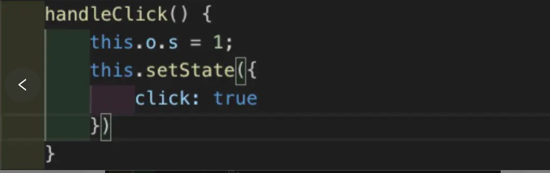

# 关于React错误捕捉这件事

> 心得体会：全局的错误捕捉可以防止页面崩溃，是必不可少的需要注意的点，记录下Error Boundaries的用法和window.onerror配合使用

## 背景

React 16+ 提供了 Error Boundaries 错误边界。 

部分 UI 中的 JavaScript 错误不应该破坏整个应用程序。 为了解决 React 用户的这个问题，React 16引入了一个 “错误边界(Error Boundaries)” 的新概念。

错误边界是 React 组件，它可以 **在子组件树的任何位置捕获 JavaScript 错误，记录这些错误，并显示一个备用 UI** ，而不是使整个组件树崩溃。 错误边界(Error Boundaries) 在渲染，生命周期方法以及整个组件树下的构造函数中捕获错误。

> 注意
>
> 错误边界 **无法** 捕获如下错误:
>
> 事件处理 （[了解更多](https://links.jianshu.com/go?to=http%3A%2F%2Freact.html.cn%2Fdocs%2Ferror-boundaries.html%23%E4%BA%8B%E4%BB%B6%E5%A4%84%E7%90%86%E5%99%A8%E5%A6%82%E4%BD%95%E5%A4%84%E7%90%86%EF%BC%9F)）
>
> 异步代码 （例如 setTimeout 或 requestAnimationFrame 回调函数）
>
> 服务端渲染
>
> 错误边界自身抛出来的错误 （而不是其子组件）

## 01 实战

我们先用 [create-react-app](https://links.jianshu.com/go?to=https%3A%2F%2Fgithub.com%2Ffacebook%2Fcreate-react-app) 搭建一个例子。 

> npx create-react-app react-error-boundary
>
> cd react-error-boundary 
>
> npm start

如果这里 npm start 出错，可以重新安装 node_modules 试试

> rm -rf node_modules
>
> sudo cnpm i 

还有可能 npm 用国外源太慢，可以用淘宝的 npm 镜像。 

> npm config set registry https://registry.npm.taobao.org
>
> npm config get registry  // 看看镜像设置对了没

OK， npm start 成功之后， localhost:3000 就可以看到 demo 页面了。 

新建文件 ErrorBoundary.js


这里需要注意DidCatch方法中的处理：

```javascript
componentDidCatch(error, info) {
    const isNewError = (error.toString() !== this.state.prevError.toString());// should only run once
    if (isNewError) {//判断两次错误不一致才再次执行，不然一直循环
      this.logErrorToMyService(error, info);
      this.setState({ prevError: error });
    }
  }
```


新建文件 ErrorComponent.js


将这两个组件引入在 App.js, 如下， 

> <ErrorBoundary>
>
> ​         <ErrorComponent />
>
> ​     </ErrorBoundary>

观察到虽然 componentDidCatch 捕获到了错误，但是页面还是中断了。 


这是因为 npm start 是在开发模式，开发模式下 Error Boundary 还是会直接报错。

可以进入 production 模式看下效果， 

> npm run build 
>
> sudo cnpm i serve -g 
>
> serve -s build 

可以看到父组件捕获到了子组件的错误，并且页面正常显示。 


那么我们完全可以在 componentDidCatch 中对错误做上报。 


可以在项目的根节点出包含在 <ErrorBoundary />组件里面，子组件的错误都会被捕获到，


如果没有用 ErrorBoundary 用 componentDidCatch 捕获错误，在 window.onerror 也是可以捕获到错误的。用错误边界的唯一好处就是保证页面正常运行。

## 02 哪些错误不能捕获 

（1）事件错误 



上面 this.o 不存在，会报错，window.onerror 可以捕获，但是错误边界捕获不到。 

（2）异步代码 


（3）服务端渲染 和 错误边界自己的错误 


## 其他方法


* 使用window.onerror全局捕获异常

```javascript
window.onerror = function (errorMessage, scriptURI, lineNo, columnNo, error) {
   console.log('errorMessage: ' + errorMessage); // 异常信息
   console.log('scriptURI: ' + scriptURI); // 异常文件路径
   console.log('lineNo: ' + lineNo); // 异常行号
   console.log('columnNo: ' + columnNo); // 异常列号
   console.log('error: ' + error); // 异常堆栈信息
 };
```

* 使用try catch捕获

在每个方法内进行捕获，对所有的字段进行校验

```javascript
let optionfloor = null;
try {
    optionfloor = (
      floorList ? floorList.map((item) => {
        return <Option key={item.id} value={item.id}>{item.name}</Option>
      }) : null
    )
  } catch (e) {
    optionfloor = null;
     
  }

```

总结：项目内进行的异常判断少之又少，这是很危险的行为，每次接口出现的数据不符合预期都会出现空白页崩的现象。在未来的项目内，异常判断也要加入规范内，是项目很重要的一个组成部分，最起码的全局有异常捕获，其次每个具体的页面内判断字段是否存在，类型是否正确。


参考： https://www.jianshu.com/p/3ae9838ed51c