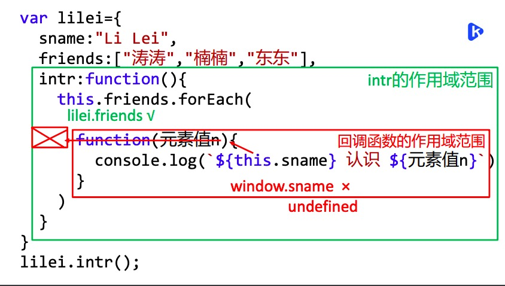
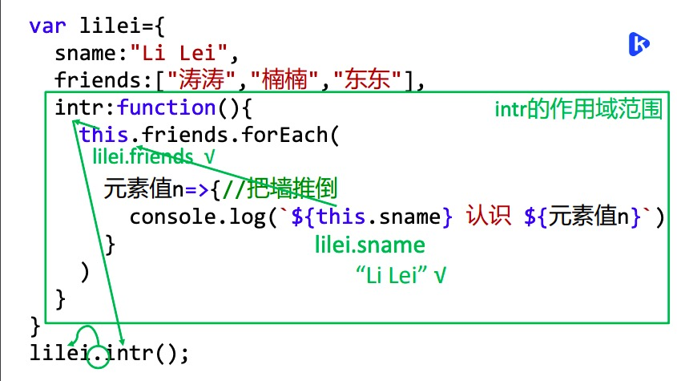
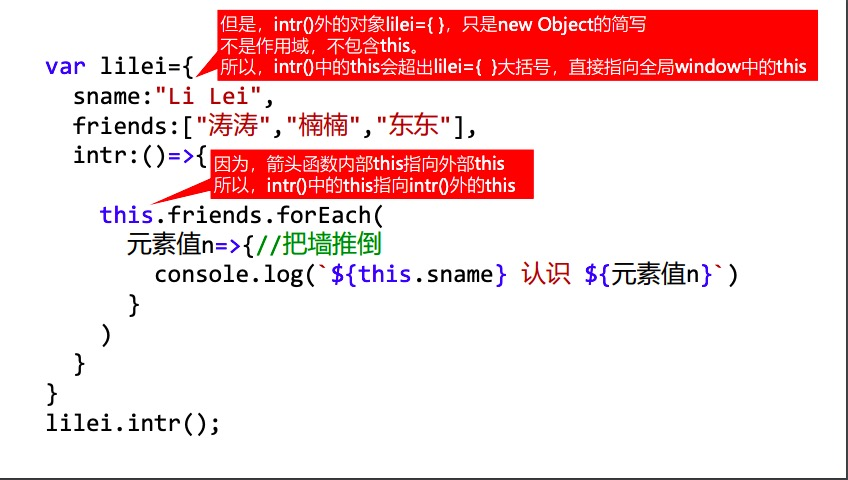

## 前端知识积累

#### 1.react中事件处理时为什么要手动绑定this?

- 之前一直没有深入研究过这个问题, 重读react文档后仔细研究了一下这个问题.
  我们都知道普通js函数中this的指向是调用函数的对象,而且是离谁近指向谁.
  非严格模式下, this默认指向全局对象window
  严格模式下, this为undefined

  **而箭头函数是在定义时就已经确定好了this的指向, 不会根据谁调用它而改变**

  基于此, 在react中为什么直接 onClick={this.handleClick} 不可以呢?

  根本原因是react中的dom是虚拟dom, JSX是React.createElement(component, props, ...children) 的语法糖, 在我们调用事件函数的时候其实这段代码

```javascript
render(){
    return (<a href="#" onClick={this.handleClick}>click me </a>
})
```

是被解析成

```javascript
render(){
   return React.createElement(
    "a", 
    { onClick: this.handleClick}, 
    "click me"
    );
   }
```

这样的代码的, `onClick = {function}` 中的`onClick`本身就是一个"中间变量", `this.handleClick`又作为一个callback传给另一个函数, 这时候this就丢失了.举个简单例子

```javascript
class Cat {
 sayThis () {
    console.log(this); 
  }

 exec (cb) {
    cb();
  }

 render () {
    this.exec(this.sayThis);
  }
}
```

**其中的sayThis又作为参数传给exec作为一个回调函数时, this已经丢失了
因此我们要在react的事件处理中进行bind this **

复杂来说, 就要讲到react合成事件了

#### react合成事件

所有事件挂载到document上
Event不是原生的, 是合成事件对象
和Vue事件不同, 和DOM事件也不同

```javascript
        event.preventDefault() // 阻止默认行为
        event.stopPropagation() // 阻止冒泡
        console.log('target', event.target) // 指向当前元素，即当前元素触发
        console.log('current target', event.currentTarget) // 指向当前元素，假象！！！

        // 注意，event 其实是 React 封装的。可以看 __proto__.constructor 是 SyntheticEvent 组合事件
        console.log('event', event) // 不是原生的 Event ，原生的 MouseEvent
        console.log('event.__proto__.constructor', event.__proto__.constructor)

        // 原生 event 如下。其 __proto__.constructor 是 MouseEvent
        console.log('nativeEvent', event.nativeEvent)
        console.log('nativeEvent target', event.nativeEvent.target)  // 指向当前元素，即当前元素触发
        console.log('nativeEvent current target', event.nativeEvent.currentTarget) // 指向 document ！！！

        // 1. event 是 SyntheticEvent ，模拟出来 DOM 事件所有能力
        // 2. event.nativeEvent 是原生事件对象
        // 3. 所有的事件，都被挂载到 document 上
        // 4. 和 DOM 事件不一样，和 Vue 事件也不一样

```

某元素触发事件后 -> 冒泡到document上(合成事件都绑定到document上) -> 实例化成统一的react event -> dispatchEvent将事件交由对应的处理器执行


#### 思考: 为什么要使用合成事件机制

- 更好的兼容性和跨平台
- 挂载到document上, 减少内存消耗, 避免频繁解绑
- 方便事件的统一管理

那么, 相比于`onClick={() => this.handleClick}` 和

```javascript
onClick={this.handleClick}
handleClick = () => {}
```


#### 两种绑定this的方法, 哪种更好呢?

使用第一种方法绑定, 会创建一个新函数, 那么每次组件更新时, onClick都会传一个新的箭头函数实例, 影响性能.
因此第二种方法更好一些


#### 2.this共有几种情况

判断this 一定不要看在哪里定义。一定只看将来在哪里，如何被调用。

1. obj.fun() this->.前的obj对象
2. new构造函数() this->new正在创建的新对象 
3. 构造函数.prototype.fun=function(){} 因为将来原型对象中的方法，都是”子对象.fun()”方式调用。 所以，this->将来调用这个fun函数的.前的某个子对象
4. fun()、匿名函数自调和回调函数中的 this->window 严格模式(usestrict)下，this->undefined 因为这类函数调用时，前边即没有.，也没有new！

比如

```javascript
比如:
(function(){ … this …})();
和
arr.forEach(
function(){ … this … }
);
```

5.button.onclick=function(){} 或 button.addEventListener(“click”,function(){…}) DOM事件处理函数里的this->当前正在出发事件的.前的DOM元素对象。

**强调: 这里不能改成箭头函数！ 一旦改为箭头函数，this指外层的window。 功能就会出错。**

6.Vue中this默认都指当前vue对象

```javascript
<button@click=”fun”>
export default{
methods:{
//vue中methods中的方法中的this默认都指当前vue组件对象
fun(e){ e.target }
//如果想获得当前出发事件的DOM元素对象，必须用$event关键
字和e.target联合使用
}
}
```

7.箭头函数中的this->当前函数之外最近的作用域中的this

- 几乎所有匿名函数都可用箭头函数简化 
- 箭头函数是对大多数匿名函数的简写


#### 3.所有function都 可改为箭头函数吗？

```javascript
var lilei={
	sname:"Li Lei",
	friends:["涛涛","楠楠","东东"],
	intr:function(){
		this.friends.forEach(
		function(元素值n){
			console.log(`${this.sname} 认识 ${元素值n}`)
		})
	}
}
lilei.intr();
//undefined 认识 涛涛
//undefined 认识 楠楠
//undefined 认识 东东
```

如图分析：




函数作用域就 像实体墙 隔绝了内部的this与外部的this， 使内外this不一样

解决方式：回调函数改为 箭头函数

箭头函数特征：箭头函数可让函数内的this 与函数外的this保持一致！




**那么，对象的intr方法上 还有个function 能不能改成箭头函数？**




#### 结论

* 如果函数中就不包含this或刚好希望函数内的this与外部this保持一致时，就可以改为箭头函数 

* 如果反而不希望函数内的this与函数外的this保持一致时，都不能改为箭头函数。