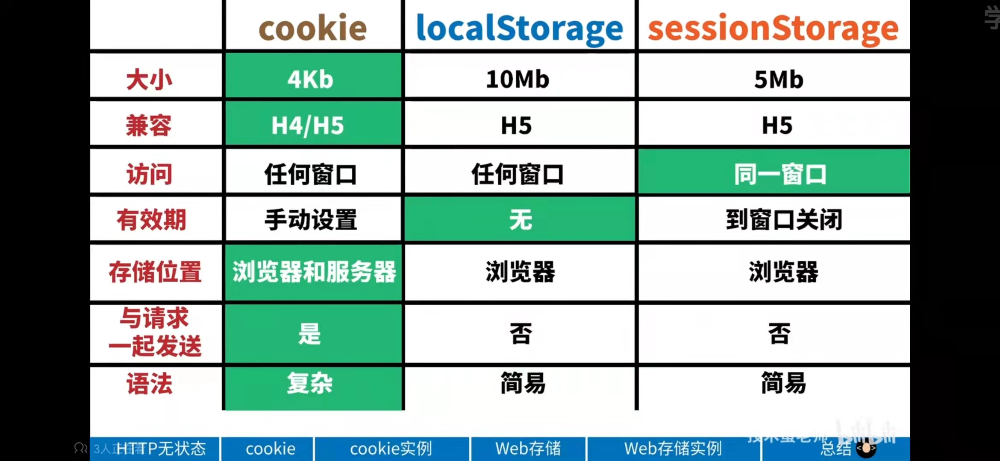

# cookie、localStorage、sessionStorage

### 看图说话！

**Cookie基于HTTP规范，用来识别用户。**

Cookie是服务器发送到浏览器的一小段数据，会在浏览器下次向同一服务器再发起请求时被携带并发送到服务器上。

Cookie诞生之初的作用就是解决HTTP的无状态请求，用来记录一些用户相关的一些状态。

- 会话状态管理（如用户登录状态、购物车、游戏分数或其它需要记录的信息）
- 个性化设置（如用户自定义设置、主题等）
- 浏览器行为跟踪（如跟踪分析用户行为等）

Cookie的原生api不友好，需要自行封装一下。下面是封装后的方法。

 

# **webStorage基于HTML5规范**

HTML5 提供了两种在客户端存储数据的新方法：localStorage和sessionStorage，挂载在window对象下。

webStorage是本地存储，数据不是由服务器请求传递的。从而它可以存储大量的数据，而不影响网站的性能。

Web Storage的目的是为了克服由cookie带来的一些限制，当数据需要被严格控制在客户端上时，无须持续地将数据发回服务器。比如客户端需要保存的一些用户行为或数据，或从接口获取的一些短期内不会更新的数据，我们就可以利用Web Storage来存储。

;)

**localStorage**的生命周期是永久性的。localStorage存储的数据，即使关闭浏览器，也不会让数据消失，除非主动的去删除数据。如果 想设置失效时间，需自行封装。

**sessionStorage** 的生命周期是在浏览器关闭前。

　　特性：

- 关闭浏览器sessionStorage 失效；
- 页面刷新不会消除数据；
- 只有在当前页面打开的链接，才可以访sessionStorage的数据，使用window.open打开页面和改变localtion.href方式都可以获 取到sessionStorage内部的数据;

;)

 

# **总结：**

| **存储方式**   | **作用与特性**                                               | **存储数量及大小**                                           | **api**                                                      |
| -------------- | ------------------------------------------------------------ | ------------------------------------------------------------ | ------------------------------------------------------------ |
| cookie         | ● 存储用户信息，获取数据需要与服务器建立连接。● 可存储的数据有限，且依赖于服务器，无需请求服务器的数据尽量不要存放在cookie中，以免影响页面性能。● 可设置过期时间。 | ● 最好将cookie控制在4095B以内，超出的数据会被忽略。● IE6或更低版本最多存20个cookie； IE7及以上版本最多可以有50个；Firefox最多50个；chrome和Safari没有做硬性限制。 | 原生、$.cookie（详见上文）                                   |
| localStorage   | ● 存储客户端信息，无需请求服务器。● 数据永久保存，除非用户手动清理客户端缓存。● 开发者可自行封装一个方法，设置失效时间。 | 5M左右，各浏览器的存储空间有差异。（感兴趣的同学可以自己试一下）。 | // 保存数据到 localStoragelocalStorage.setItem('key', 'value');// 从 localStorage 获取数据let data = localStorage.getItem('key');// 从 localStorage 删除保存的数据localStorage.removeItem('key');// 从 localStorage 删除所有保存的数据localStorage.clear(); |
| sessionStorage | ● 存储客户端信息，无需请求服务器。● 数据保存在当前会话，刷新页面数据不会被清除，结束会话（关闭浏览器、关闭页面、跳转页面）数据失效。 | 同localStorage                                               | // 保存数据到 sessionStoragesessionStorage.setItem('key', 'value');// 从 sessionStorage 获取数据let data = sessionStorage.getItem('key');// 从 sessionStorage 删除保存的数据sessionStorage.removeItem('key');// 从 sessionStorage 删除所有保存的数据sessionStorage.clear(); |

参考：https://www.cnblogs.com/qiujianmei/p/10824682.html